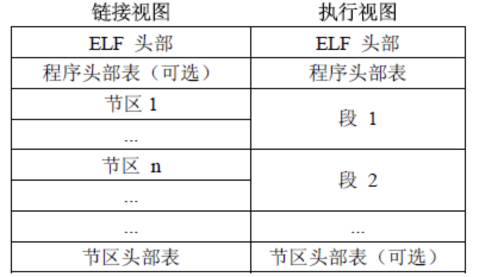

# ELF文件解析器的设计与实现

```
团队：
	计科2003 詹少雄
	计科2004 李绅
	计科2003 杜鹏
指导老师：
	任继平
```

快速跳转：

- [h指令](https://github.com/Jasaxion/LinuxELF_FileParse/blob/main/work/zsx/h%E6%8C%87%E4%BB%A4/h%E6%8C%87%E4%BB%A4%E7%9A%84%E5%8E%9F%E7%90%86%E4%B8%8EELF%E5%AE%9E%E7%8E%B0.md)
- [l指令](https://github.com/Jasaxion/LinuxELF_FileParse/blob/main/work/zsx/l%E6%8C%87%E4%BB%A4/l%E6%8C%87%E4%BB%A4%E7%9A%84%E5%8E%9F%E7%90%86%E4%B8%8EELF%E5%AE%9E%E7%8E%B0.md)
- [S指令](https://github.com/Jasaxion/LinuxELF_FileParse/blob/main/work/zsx/S%E6%8C%87%E4%BB%A4/S%E6%8C%87%E4%BB%A4%E7%9A%84%E5%8E%9F%E7%90%86%E4%B8%8EELF%E5%AE%9E%E7%8E%B0.md)
- [g指令](https://github.com/Jasaxion/LinuxELF_FileParse/blob/main/work/dp/g%E6%8C%87%E4%BB%A4/g%E6%8C%87%E4%BB%A4%E7%9A%84%E5%8E%9F%E7%90%86%E4%B8%8EELF%E5%AE%9E%E7%8E%B0.md)
- [s指令](https://github.com/Jasaxion/LinuxELF_FileParse/blob/main/work/dp/s%E6%8C%87%E4%BB%A4/s%E6%8C%87%E4%BB%A4%E7%9A%84%E5%8E%9F%E7%90%86%E4%B8%8EELF%E5%AE%9E%E7%8E%B0.md)
- [t指令](https://github.com/Jasaxion/LinuxELF_FileParse/blob/main/work/dp/t%E6%8C%87%E4%BB%A4/t%E6%8C%87%E4%BB%A4%E7%9A%84%E5%8E%9F%E7%90%86%E4%B8%8EELF%E5%AE%9E%E7%8E%B0.md)
- [e指令](https://github.com/Jasaxion/LinuxELF_FileParse/blob/main/work/ls/e%E6%8C%87%E4%BB%A4/e%E6%8C%87%E4%BB%A4%E7%9A%84%E5%8E%9F%E7%90%86%E4%B8%8EELF%E5%AE%9E%E7%8E%B0.md)
- [n指令](https://github.com/Jasaxion/LinuxELF_FileParse/blob/main/work/ls/n%E6%8C%87%E4%BB%A4/n%E6%8C%87%E4%BB%A4%E7%9A%84%E5%8E%9F%E7%90%86%E4%B8%8EELF%E5%AE%9E%E7%8E%B0.md)
- [r指令](https://github.com/Jasaxion/LinuxELF_FileParse/blob/main/work/ls/r%E6%8C%87%E4%BB%A4/r%E6%8C%87%E4%BB%A4%E7%9A%84%E5%8E%9F%E7%90%86%E4%B8%8EELF%E5%AE%9E%E7%8E%B0.md)

## ELF文件格式

首先我们先来介绍一下ELF文件格式。总体来说，ELF文件可以细分为三类。

- **可重定位文件**。可重定位文件中包含链接器需要的代码和数据信息，链接器根据这些信息将多个可重定位文件通过链接过程生成可执行文件（executable）或者生成共享库（shared object file）。
- **可执行文件**。顾名思义，可执行文件中包含最后需要执行的程序。它的信息用于指导操作系统如何生成最后的进程映像（process image）。
- **共享库文件**。共享库中的代码和数据主要有两个用途。第一，静态链接器（例如GNU ld）利用共享库和可重定位文件生成最终的目标文件（可以是可执行文件，也可以是生成新的共享库）。第二，动态链接器（例如GNU ld-linux.so）利用共享库和可执行文件来生成最终的进程映像。

经过编译器和链接器一系列处理后的目标文件（可执行文件或者共享库）就是程序最终的二进制表现形式，这些二进制是处理器可以识别的指令序列。注意，某些程序的执行必须通过解释器的帮助才能执行。

### ELF文件的作用

ELF文件参与程序的连接(建立一个程序)和程序的执行(运行一个程序)，所以可以从不同的角度来看待ELF格式的文件：

- 如果用于编译和链接（可重定位文件），则编译器和链接器将把ELF文件看作是节头表描述的节的集合,程序头表可选。
  - 
- 如果用于加载执行（可执行文件），则加载器则将把ELF文件看作是程序头表描述的段的集合，一个段可能包含多个节，节头表可选。
  - 
- 如果是共享文件，则两者都含有。

> ELF文件描述，从两种不同的视图来体现。



从左边可以看出，包含了一个ELF头部，它描绘了整个文件的组织结构。它还包括很多节区（section）。这些节有的是系统定义好的，有些是用户在文件在通过.section命令自定义的，链接器会将多个输入目标文件中的相同的节合并。节区部分包含链接视图的大量信息：指令、数据、符号表、重定位信息等等。除此之外，还包含程序头部表（可选）和节区 头部表，程序头部表，告诉系统如何创建进程映像。用来构造进程映像的目标文件必须具有程序头部表，可重定位文件不需要这个表。而节区头部表（Section Heade Table）包含了描述文件节区的信息，每个节区在表中都有一项，每一项给出诸如节区名称、节区大小这类信息。用于链接的目标文件必须包含节区头部表，其他目标文件可以有，也可以没有这个表。

需要注意地是：尽管图中显示的各个组成部分是有顺序的，实际上除了 ELF 头部表以外，其他节区和段都没有规定的顺序。

右半图是以程序执行视图来看待的，与左边对应，多了一个段（segment）的概念，编译器在生成目标文件时，通常使用从零开始的相对地址，而在链接过程中，链接器从一个指定的地址开始，根据输入目标文件的顺序，以段（segment）为单位将它们拼装起来。其中每个段可以包括很多个节（section）。


### ELF指令的选项

```
-a , --all 显示全部信息,等价于 -h -l -S -s -r -d -V -A -I 。
-h , --file-header 显示 elf 文件开始的文件头信息.
-l , --program-headers , --segments 显示程序头（段头）信息(如果有的话)。
-S , --section-headers , --sections 显示节头信息(如果有的话)。
-g , --section-groups 显示节组信息(如果有的话)。
-t , --section-details 显示节的详细信息( -S 的)。
-s , --syms , --symbols 显示符号表段中的项（如果有的话）。
-e , --headers 显示全部头信息，等价于: -h -l -S
-n , --notes 显示 note 段（内核注释）的信息。
-r , --relocs 显示可重定位段的信息。
-u , --unwind 显示 unwind 段信息。当前只支持 IA64 ELF 的 unwind 段信息。
-d , --dynamic 显示动态段的信息。
-V , --version-info 显示版本段的信息。
-A , --arch-specific 显示 CPU 构架信息。
-D , --use-dynamic 使用动态段中的符号表显示符号，而不是使用符号段。
-x , --hex-dump= 以16进制方式显示指定段内内容。 number 指定段表中段的索引,或字符串指定文件中的段名。
-I , --histogram 显示符号的时候，显示 bucket list 长度的柱状图。
-v , --version 显示 readelf 的版本信息。
-H , --help 显示 readelf 所支持的命令行选项。
-W , --wide 宽行输出。
```

