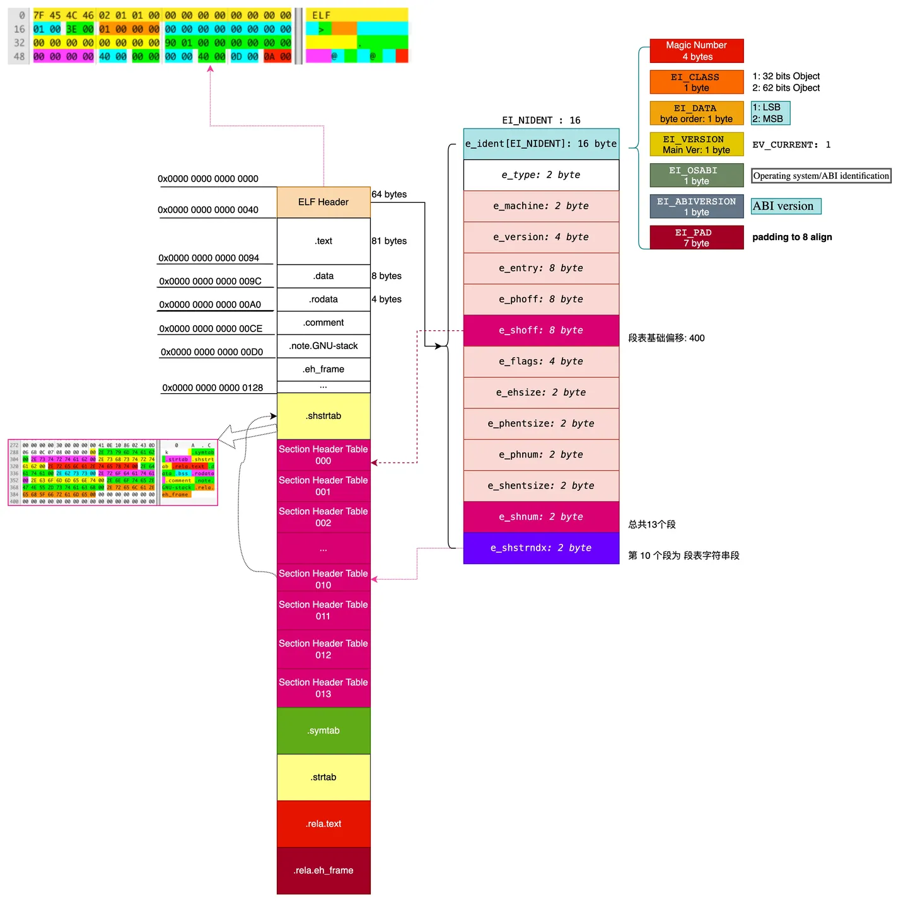
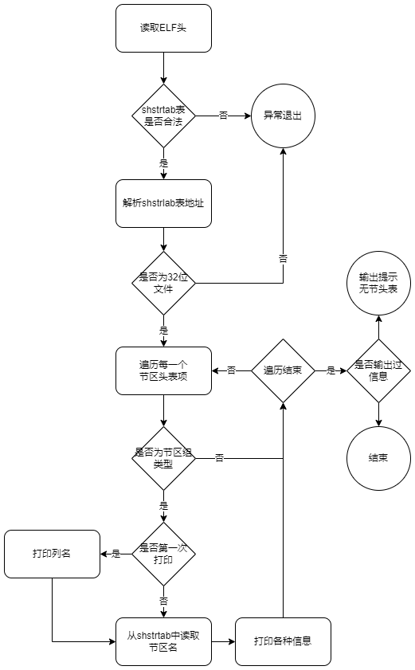

# 选项-g 的原理和具体实现

---

## 选项-g 的介绍

#### Section 节区

如下图所示是一个ELF文件的示意图：



当要读取一个节区的时候，我们难以知道一个节区的起始地址，因此就无法访问这个节区。此时引入节区头表(Section Header)，在节区头表中，记录了每一个节区的名字、地址、大小等信息。同时，由于节区头表在文件中间，因此程序在开始解析时，首先会读取它的ELF头(Header)，在ELF头中，存放有节区头表的偏移地址等信息。自此，就完成了对任意节区的访问。

例如，当我们需要访问第i个节区的时候，通过以下的步骤即可完成：

1. 读取ELF头，得到到节区头表的位置；
2. 依据索引i，通过指针加法运算得到第i个节区对应的节区头表项；
3. 读取节区头表项，得到节区i的名字、地址等信息。

#### 节区头表数据结构定义

节区头表是一个数组，它的子项由Elf32_Shdr类型构成。Elf32_Shdr的定义如下：

```c
/* Section header.  */

typedef struct
{
  Elf32_Word	sh_name;		/* Section name (string tbl index) */
  Elf32_Word	sh_type;		/* Section type */
  Elf32_Word	sh_flags;		/* Section flags */
  Elf32_Addr	sh_addr;		/* Section virtual addr at execution */
  Elf32_Off	sh_offset;		/* Section file offset */
  Elf32_Word	sh_size;		/* Section size in bytes */
  Elf32_Word	sh_link;		/* Link to another section */
  Elf32_Word	sh_info;		/* Additional section information */
  Elf32_Word	sh_addralign;		/* Section alignment */
  Elf32_Word	sh_entsize;		/* Entry size if section holds table */
} Elf32_Shdr;
```

1. sh_name：节区名字符串索引。在shstrtab表中依据提供的索引，找到对应的字符串作为节区名。
2. sh_type：节区类型，对该节区的内容和语义进行分类。
3. sh_flags：节区标志位
4. sh_addr：如果该部分将出现在进程的内存映像中，则此成员给出该部分的第一个字节应驻留的地址虚拟地址默认为0x0。
5. sh_offset该成员的值给出了从文件开头到节中第一个字节的字节偏移偏移量 sh_size节的大小。
6. sh_link该成员持有节头表索引链接，其解释取决于节类型。见后面。
7. sh_info该成员包含额外信息，其解释取决于部分类型。见后面。
8. sh_addralign某些部分具有地址对齐约束。例如，如果一个节包含一个双字，系统必须确保整个节的双字对齐。 取模的值必须等于0。
9. sh_entsize某些部分包含固定大小条目的表，例如符号表。对于这样的部分，该成员给出了每个条目的字节大小。 如果该部分不包含固定大小条目的表，则为0

其中sh_link和sh_info的具体释义取决于sh_type的类型。如下表所示：

| sh_type                 | sh_link                            | sh_info                                                            |
| ----------------------- | ---------------------------------- | ------------------------------------------------------------------ |
| SHT_DYNAMIC             | 节中条目使用的字符串表的节头索引。 | 0                                                                  |
| SHT_HASH                | 哈希表适用的符号表的节头索引。     | 0                                                                  |
| SHT_REL & SHT_RELA      | 关联符号表的节头索引。             | 重定位应用的部分的部分标题索引。                                   |
| SHT_SYMTAB & SHT_DYNSYM | 关联字符串表的节标题索引。         | 比最后一个局部符号（绑定）的符号表索引大一STB_LOCAL。              |
| SHT_GROUP               | 关联符号表的节头索引。             | 关联符号表中条目的符号表索引。指定符号表条目的名称为节组提供签名。 |
| SHT_SYMTAB_SHNDX        | 关联符号表节的节头索引。           | 0                                                                  |

#### ELF头表中与节区头表相关成员

在ELF头表中，指明了节区头表的相关信息，如下表所示：

| ELF头表成员 | 含义                       |
| ----------- | -------------------------- |
| e_shoff     | 文件从头到节区头表的偏移量 |
| e_shnum     | 节区头表包含多少的条目     |
| e_shentsize | 每个条目的字节大小         |
| e_shstrndx  | 节区名表在节区头表中的位置 |

#### Section Group 节区分组

有关节区分组的中文资料较少且二手不靠谱，原资料[链接https://docs.oracle.com/cd/E23824_01/html/819-0690/chapter7-26.html](https://docs.oracle.com/cd/E23824_01/html/819-0690/chapter7-26.html).

Section Group是一个特殊的节区，这个节区中包含的内容指向了一组其他的节区，并且需要被链接器特殊对待。SHT_GROUP类型的节区仅仅只会出现在可重定位目标文件（目标文件的ELF头中e_type成员必须为ET_REL）。

有些Section出现在相互关联的组中。例如，内联函数的定义可能需要除包含可执行指令的部分之外的其他信息（例如包含引用文字的只读数据Section、一个或多个调试信息Section或其他信息Section），即内联函数包括了其他Section的信息。它用于将Section组合在一起，告诉链接器如果它在组中包含某个Section，那么它也必须包含同组的其它Section。

Section Group的类型名为SHT_GROUP。该Section Header的结构同Elf32_Shdr

本readelf只读取了节头信息，并没有读取具体的内容。查阅资料，对于SHT_GROUP，其结构是一个Elf32_Word数组，第0个表示flag标志，随后的每个字表示同组内section的索引，指向同组的section。

Section Group有一个标志位如下：

| Name         | Value      |
| ------------ | ---------- |
| GRP_COMDAT   | 0x1        |
| GRP_MASKOS   | 0x0ff00000 |
| GRP_MASKPROC | 0xf0000000 |

**COMDAT**

在这种情况下，链接编辑器只会保留一个重复组。其余的组将被丢弃。即当Section Group的标志为GRP_COMDAT时，它告诉链接器如果在两个.o目标文件中出现了同一个组，那么它只需要包含其中一个，另外一个丢弃掉。用于删除重复的C++实例化的模版。

当在由多个目标文件时，如果出现了相同的COMDAT节区分组，那么在这种情况下，链接器只会保留一个重复的组，其他组的成员被丢弃。

**MASKOS**

此掩码中包含的所有位都保留用于特定于操作系统的语义。

**GRP_MASKPROC**

此掩码中包含的所有位都保留用于特定于处理器的语义。如果指定了含义，处理器补充说明它们。

## 选项-g 的作用

```shell
readelf -g
        --section-groups
```

该指令用于显示ELF文件Section Group（节区分组）的信息。

## 选项-g 显示的信息解释

```shell
dp@ubuntu:~/Desktop/elf/7.9/testg$ ./main testg-template.o -g
  [Nr] Name              Type            Addr     Off    Size   ES Flg Lk Inf Al
  [ 1] .group            GROUP           00000000 000034 00000c 04    20  24   4
  [ 2] .group            GROUP           00000000 000040 000008 04    20  27   4
  [ 3] .group            GROUP           00000000 000048 000008 04    20  22   4
```

列名的含义如下：

| 列名 | 含义                                 | 变量                 | 大小       |
| ---- | ------------------------------------ | -------------------- | ---------- |
| Name | 节区名                               | 特殊，从shstrtab读取 | max20B     |
| Type | 节区类型                             | sh_type              | Elf32_Word |
| Addr | 节区在被执行时的虚拟地址             | sh_addr              | Elf32_Addr |
| Off  | 节区在文件中的偏移地址               | sh_offset            | Elf32_Off  |
| Size | 节区的大小                           | sh_size              | Elf32_Word |
| ES   | (如果节区含有表)节区每一个条目的大小 | sh_entsize           | Elf32_Word |
| Flg  | 节区标志位                           | sh_flags             | Elf32_Word |
| Lk   | 包含的条目的符号表节区的节头索引     | sh_link              | Elf32_Word |
| Inf  | 包含的条目的符号表索引               | sh_info              | Elf32_Word |
| Al   | 节区对齐                             | sh_addralign         | Elf32_Word |

接下来我们来分析其中的第一条：

1. Name：节区名为.group，它是通过节区的sh_name属性得到节区名字在shstrtab表中的索引，然后加上shstrtab表的偏移地址，得到最终名字字符串的起始地址，直接读取20字字符，因为里面存的每一个字符串都是以'\\0'结尾的，因此直接读取输出即可。
2. Type：节区类型为GROUP，这个在elf.h中定义为SHT_GROUP，为sh_type的可取值。表明这是一个节区分组类型的节区。
3. Addr：全0且无意义，因为我们查看的是目标文件，还会对这些地址进行重定位的。
4. Off：节区在文件中的偏移地址为0x000034，表示从这个位置开始是本节区的数据。
5. Size：节区的大小为0xC即12字节。
6. ES：由于Section Group类型的节区是一个数组，第0个表示flag标志，随后的每个字表示同组内section的索引，指向同组的section。所以标识数组中每个条目的大小为4字节，即该节区含有12B/4B=3个条目。使用原生readelf工具进行验证，如下图所示：

   ```shell
   dp@ubuntu:~/Desktop/elf/7.9/testg$ readelf -g testg-template.o

   COMDAT group section [    1] `.group' [_Z3addIiET_S0_S0_] contains 2 sections:
      [Index]    Name
      [    9]   .text._Z3addIiET_S0_S0_
      [   10]   .rel.text._Z3addIiET_S0_S0_

   COMDAT group section [    2] `.group' [__x86.get_pc_thunk.ax] contains 1 sections:
      [Index]    Name
      [   13]   .text.__x86.get_pc_thunk.ax

   COMDAT group section [    3] `.group' [__x86.get_pc_thunk.bx] contains 1 sections:
      [Index]    Name
      [   14]   .text.__x86.get_pc_thunk.bx
   ```

   这个数字恰好是一个flag标志(COMDAT)，和2条同组Section索引，指向.text._Z3addIiET_S0_S0和.rel.text.___Z3addIiET_S0_S0这两个节区_。
7. Flg：标志位空。
8. Lk：包含条目的符号表节的节头索引为20。使用原生readelf工具进行验证，如下图所示：

   ```shell
   p@ubuntu:~/Desktop/elf/7.9/testg$ readelf -S testg-template.o
   There are 23 section headers, starting at offset 0x748:

   Section Headers:
     [Nr] Name              Type            Addr     Off    Size   ES Flg Lk Inf Al
     [ 0]                   NULL            00000000 000000 000000 00      0   0  0
     [ 1] .group            GROUP           00000000 000034 00000c 04     20  24  4
     [ 2] .group            GROUP           00000000 000040 000008 04     20  27  4
     [ 3] .group            GROUP           00000000 000048 000008 04     20  22  4
     [ 4] .text             PROGBITS        00000000 000050 0000dc 00  AX  0   0  1
     [ 5] .rel.text         REL             00000000 0005a8 000078 08   I 20   4  4
     [ 6] .data             PROGBITS        00000000 00012c 000000 00  WA  0   0  1
     [ 7] .bss              NOBITS          00000000 00012c 000001 00  WA  0   0  1
     [ 8] .rodata           PROGBITS        00000000 00012c 000001 00   A  0   0  1
     [ 9] .text._Z3addIiET_ PROGBITS        00000000 00012d 00001b 00 AXG  0   0  1
     [10] .rel.text._Z3addI REL             00000000 000620 000010 08  IG 20   9  4
     [11] .init_array       INIT_ARRAY      00000000 000148 000004 04  WA  0   0  4
     [12] .rel.init_array   REL             00000000 000630 000008 08   I 20  11  4
     [13] .text.__x86.get_p PROGBITS        00000000 00014c 000004 00 AXG  0   0  1
     [14] .text.__x86.get_p PROGBITS        00000000 000150 000004 00 AXG  0   0  1
     [15] .comment          PROGBITS        00000000 000154 00002c 01  MS  0   0  1
     [16] .note.GNU-stack   PROGBITS        00000000 000180 000000 00      0   0  1
     [17] .note.gnu.propert NOTE            00000000 000180 00001c 00   A  0   0  4
     [18] .eh_frame         PROGBITS        00000000 00019c 0000d8 00   A  0   0  4
     [19] .rel.eh_frame     REL             00000000 000638 000030 08   I 20  18  4
     [20] .symtab           SYMTAB          00000000 000274 000200 10     21  21  4
     [21] .strtab           STRTAB          00000000 000474 000134 00      0   0  1
     [22] .shstrtab         STRTAB          00000000 000668 0000dd 00      0   0  1
   Key to Flags:
     W (write), A (alloc), X (execute), M (merge), S (strings), I (info),
     L (link order), O (extra OS processing required), G (group), T (TLS),
     C (compressed), x (unknown), o (OS specific), E (exclude),
     p (processor specific)

   ```

   索引为20的节区正好是符号表symtab所在的节区。
9. Inf：标识元素的符号表索引为21。使用原生readelf工具打印其符号表，如下图所示：

   ```shell
   dp@ubuntu:~/Desktop/elf/7.9/testg$ readelf -s testg-template.o

   Symbol table '.symtab' contains 32 entries:
      Num:    Value  Size Type    Bind   Vis      Ndx Name
        0: 00000000     0 NOTYPE  LOCAL  DEFAULT  UND 
        1: 00000000     0 FILE    LOCAL  DEFAULT  ABS testg-template.cpp
        2: 00000000     0 SECTION LOCAL  DEFAULT    4 
        3: 00000000     0 SECTION LOCAL  DEFAULT    6 
        4: 00000000     0 SECTION LOCAL  DEFAULT    7 
        5: 00000000     0 SECTION LOCAL  DEFAULT    8 
        6: 00000000     1 OBJECT  LOCAL  DEFAULT    8 _ZStL19piecewise_construc
        7: 00000000     1 OBJECT  LOCAL  DEFAULT    7 _ZStL8__ioinit
        8: 00000000     0 SECTION LOCAL  DEFAULT    9 
        9: 00000057    93 FUNC    LOCAL  DEFAULT    4 _Z41__static_initializati
       10: 000000b4    40 FUNC    LOCAL  DEFAULT    4 _GLOBAL__sub_I_main
       11: 00000000     0 SECTION LOCAL  DEFAULT   11 
       12: 00000000     0 SECTION LOCAL  DEFAULT   13 
       13: 00000000     0 SECTION LOCAL  DEFAULT   14 
       14: 00000000     0 SECTION LOCAL  DEFAULT   16 
       15: 00000000     0 SECTION LOCAL  DEFAULT   17 
       16: 00000000     0 SECTION LOCAL  DEFAULT   18 
       17: 00000000     0 SECTION LOCAL  DEFAULT   15 
       18: 00000000     0 SECTION LOCAL  DEFAULT    1 
       19: 00000000     0 SECTION LOCAL  DEFAULT    2 
       20: 00000000     0 SECTION LOCAL  DEFAULT    3 
       21: 00000000    87 FUNC    GLOBAL DEFAULT    4 main
       22: 00000000     0 FUNC    GLOBAL HIDDEN    14 __x86.get_pc_thunk.bx
       23: 00000000     0 NOTYPE  GLOBAL DEFAULT  UND _GLOBAL_OFFSET_TABLE_
       24: 00000000    27 FUNC    WEAK   DEFAULT    9 _Z3addIiET_S0_S0_
       25: 00000000     0 NOTYPE  GLOBAL DEFAULT  UND _ZSt4cout
       26: 00000000     0 NOTYPE  GLOBAL DEFAULT  UND _ZNSolsEi
       27: 00000000     0 FUNC    GLOBAL HIDDEN    13 __x86.get_pc_thunk.ax
       28: 00000000     0 NOTYPE  GLOBAL DEFAULT  UND _ZNSt8ios_base4InitC1Ev
       29: 00000000     0 NOTYPE  GLOBAL HIDDEN   UND __dso_handle
       30: 00000000     0 NOTYPE  GLOBAL DEFAULT  UND _ZNSt8ios_base4InitD1Ev
       31: 00000000     0 NOTYPE  GLOBAL DEFAULT  UND __cxa_atexit

   ```

   得到符号表对应的符号为_Z3addIiET_S0_S0_，正好与Section Group中的项目一致。
10. Al：节区对齐4B，因为本节区是一个表，所以项的大小是固定的，需要进行对齐。

## 代码实现

### 算法思路

算法的总体思想较为简单，分为以下的步骤进行：

1. 读取shstrtab节区，并记录偏移地址；
2. 遍历节区头表中的每一项，如果是Section Group节区分组类型的节区头表项，那么进入步骤三；
3. 读取这个节区头表项，节区名通过sh_name从shstrtab中读取；
4. 打印相关的属性；
5. 回到步骤二直到完成全部的遍历。

### 流程图

按照上述的思想，设计的程序的流程图如下图所示：



### 测试

对于测试节区组，在代码中完成重复同一模版的不同实例化，或者多个函数，每个函数都会产生一个节区，并重定位与.text.*区相组成组。因此，测试样例设计如下：

```cpp
#include<iostream>
using namespace std;

template<typename T>
T add(T a, T b){
        return a+b;
}

int main(){
        int t = add(1,2);
        cout<<t;
        return 0;
}

```

通过指令进行编译为目标文件，再次强调只有目标文件才会有Section Group这种给链接用的东西。

```shell
dp@ubuntu:~/Desktop/elf/7.9/testg$ gcc -m32 testg-template.cpp -c
```

### 代码详细解释

```c
//读取节区头中节区分组类型的节区信息
int ELF_process::process_section_group(FILE *file) {
    //布尔判断，用于第一次打印输出表格每一列的名字  
    unsigned int flag=0;
    //节区头表项，用于遍历
    Elf32_Shdr * section;
    //初始化为空
    section = NULL;
    //存放节区名的字符表
    char * string_table;
    //节区名表shstrtab的地址
    unsigned int  flag_shoff;
    /* Read in the string table, so that we have names to display.  */
    //先判断elf头表的类型是不是未定义，如果为未定义，那么说明没有读取elf头，是错误的
    //再判断节区名表shstrtab的索引位置是不是超过了elf头中记录的最大节区数量，如果超过那么就是异常
    if (elf_header.e_shstrndx != SHN_UNDEF
        && elf_header.e_shstrndx < elf_header.e_shnum)
    {
        //根据节区表名shstrtab在节区头表中的索引位置，得到shstrtab节区的数据
        section = section_headers + elf_header.e_shstrndx;

	//提取shstrtab节区在文件中的偏移地址，
        flag_shoff = section->sh_offset;

    }
    //初始化奖节区头表项设置为第一项
    section = section_headers;
    //记录节区名字符串的偏移地址
    unsigned int countC;
    //只处理32位ELF文件
    if (is_32bit_elf){
  
        //遍历节区头表中的每一项
        for (int i = 0;
             i < elf_header.e_shnum;
             i++, section++)
        {
	    //如果该项表示的节区是节区分组类型，那么进行打印
            if(section->sh_type==SHT_GROUP){
		//如果是第一次打印，那么先打印列名
                if(!flag){
                    printf("  [Nr] Name              Type            Addr     Off    Size   ES Flg Lk Inf Al\n");
                    flag=1;
                }
                printf ("  [%2u] ", i);

		//计算节区名的偏移地址，为shstrtab节区数组的第索引sh_name
                countC = flag_shoff + section->sh_name;

		//将指针移动至节区名字符串处
                fseek(file,countC,SEEK_SET);
		//临时变量，存放节区名的字符串
                char string_name[20];
		//从文件指针处读取20个字节，由于每个名字字符串都是以'\0'结尾的，因此多读一些是没有问题的
                fread(string_name,20,1,file);

		//打印节区名
                printf("%-16s ",string_name);

		//打印节区类型，通过函数获取类型码对应的类型名
		//函数get_section_type_name()只是一个查表获取名字
                printf ( " %-15.15s ",
                        get_section_type_name (section->sh_type));

		//打印运行时的虚拟地址
                printf("%6.8lx",(unsigned long) section->sh_addr);
		//打印该节区头表项对应节区的偏移地址、节区大小、节区每项的大小
                printf ( " %6.6lx %6.6lx %2.2lx",
                            (unsigned long) section->sh_offset,
                            (unsigned long) section->sh_size,
                            (unsigned long) section->sh_entsize);

		//如果该节区头表项含有flag，那么就打印输出标志
                if (section->sh_flags)
                    printf (" %2.2x ", section->sh_flags);
		//没有标志就打印输出空格
                else
                    printf("%4c",32);

		//打印对应的包含该条目的符号表节区在节区头表中的索引
                printf ("%2u ", section->sh_link);
		//打印该元素在符号表中的索引，以及对齐信息
                printf ("%3u %3lu", section->sh_info,
                        (unsigned long) section->sh_addralign);
                printf("\n");
            }
        }
	//在结束了遍历所有节头表中的项之后，如果还没有打印过首行列名，则表示没有Section Group，打印失败信息
        if(!flag){
            printf("There are no section group in this file.\n");
	    //返回失败
            return 0;
        }
    }

    //返回成功
    return 1;
}
```
