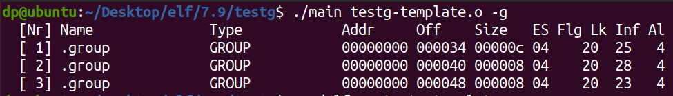

# 选项- g的原理和具体实现

---

## 选项-g 的介绍

#### Section Group 节区分组

有关节区分组的中文资料较少且二手不靠谱，原资料[链接](https://docs.oracle.com/cd/E23824_01/html/819-0690/chapter7-26.html).

有些Section出现在相互关联的组中。例如，内联函数的定义可能需要除包含可执行指令的部分之外的其他信息（例如包含引用文字的只读数据Section、一个或多个调试信息Section或其他信息Section），即内联函数包括了其他Section的信息。它用于将Section组合在一起，告诉链接器如果它在组中包含某个Section，那么它也必须包含同组的其它Section。

Section Group的类型名为SHT_GROUP。该Section Header的结构同Elf32_Shdr

本readelf只读取了节头信息，并没有读取具体的内容。查阅资料，对于SHT_GROUP，其结构是一个Elf32_Word数组，第0个表示flag标志，随后的每个字表示同组内section的索引，指向同组的section。

Section Group有一个标志位如下：

| Name       | Value |
| ---------- | ----- |
| GRP_COMDAT | 0x1   |

在这种情况下，链接编辑器只会保留一个重复组。其余的组将被丢弃。即当Section Group的标志为GRP_COMDAT时，它告诉链接器如果在两个.o目标文件中出现了同一个组，那么它只需要包含其中一个，另外一个丢弃掉。用于删除重复的C++实例化的模版。

Section Group是帮助目标文件进行链接的，因此可执行程序**没有Section Group**！

## 选项-g 的作用

    -g
    --section-groups
该指令用于显示ELF文件Section Group（节区分组）的信息

## 选项-g 显示的信息解释

## 代码实现

### 算法思路

### 流程图

### 测试

### 代码详细解释
