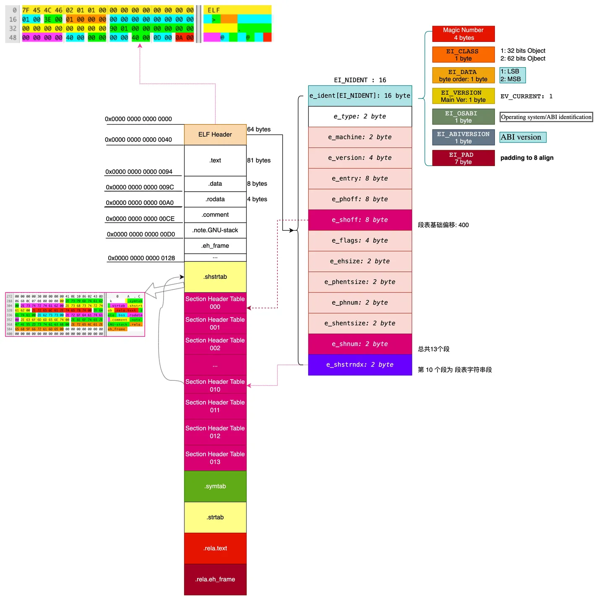
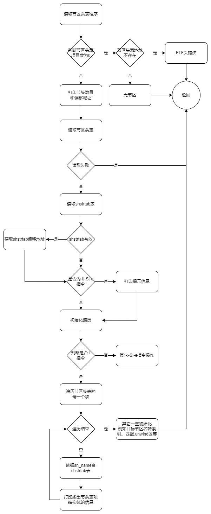

# 选项-t 的原理和具体实现

## 1.选项-t 的介绍

### 1.1.Section 节区

如下图所示是一个ELF文件的示意图：



当要读取一个节区的时候，我们难以知道一个节区的起始地址，因此就无法访问这个节区。此时引入节区头表(Section Header)，在节区头表中，记录了每一个节区的名字、地址、大小等信息。同时，由于节区头表在文件中间，因此程序在开始解析时，首先会读取它的ELF头(Header)，在ELF头中，存放有节区头表的偏移地址等信息。自此，就完成了对任意节区的访问。

例如，当我们需要访问第i个节区的时候，通过以下的步骤即可完成：

1. 读取ELF头，得到到节区头表的位置；
2. 依据索引i，通过指针加法运算得到第i个节区对应的节区头表项；
3. 读取节区头表项，得到节区i的名字、地址等信息。

### 1.2.节区头表数据结构定义

节区头表是一个数组，它的子项由Elf32_Shdr类型构成。Elf32_Shdr的定义如下：

```c
/* Section header.  */

typedef struct
{
  Elf32_Word	sh_name;		/* Section name (string tbl index) */
  Elf32_Word	sh_type;		/* Section type */
  Elf32_Word	sh_flags;		/* Section flags */
  Elf32_Addr	sh_addr;		/* Section virtual addr at execution */
  Elf32_Off	sh_offset;		/* Section file offset */
  Elf32_Word	sh_size;		/* Section size in bytes */
  Elf32_Word	sh_link;		/* Link to another section */
  Elf32_Word	sh_info;		/* Additional section information */
  Elf32_Word	sh_addralign;		/* Section alignment */
  Elf32_Word	sh_entsize;		/* Entry size if section holds table */
} Elf32_Shdr;
```

1. sh_name：节区名字符串索引。在shstrtab表中依据提供的索引，找到对应的字符串作为节区名。
2. sh_type：节区类型，对该节区的内容和语义进行分类。
3. sh_flags：节区标志位
4. sh_addr：如果该部分将出现在进程的内存映像中，则此成员给出该部分的第一个字节应驻留的地址虚拟地址默认为0x0。
5. sh_offset该成员的值给出了从文件开头到节中第一个字节的字节偏移偏移量 sh_size节的大小。
6. sh_link该成员持有节头表索引链接，其解释取决于节类型。见后面。
7. sh_info该成员包含额外信息，其解释取决于部分类型。见后面。
8. sh_addralign某些部分具有地址对齐约束。例如，如果一个节包含一个双字，系统必须确保整个节的双字对齐。 取模的值必须等于0。
9. sh_entsize某些部分包含固定大小条目的表，例如符号表。对于这样的部分，该成员给出了每个条目的字节大小。 如果该部分不包含固定大小条目的表，则为0

其中sh_link和sh_info的具体释义取决于sh_type的类型。如下表所示：

| sh_type                 | sh_link                            | sh_info                                                            |
| ----------------------- | ---------------------------------- | ------------------------------------------------------------------ |
| SHT_DYNAMIC             | 节中条目使用的字符串表的节头索引。 | 0                                                                  |
| SHT_HASH                | 哈希表适用的符号表的节头索引。     | 0                                                                  |
| SHT_REL & SHT_RELA      | 关联符号表的节头索引。             | 重定位应用的部分的部分标题索引。                                   |
| SHT_SYMTAB & SHT_DYNSYM | 关联字符串表的节标题索引。         | 比最后一个局部符号（绑定）的符号表索引大一STB_LOCAL。              |
| SHT_GROUP               | 关联符号表的节头索引。             | 关联符号表中条目的符号表索引。指定符号表条目的名称为节组提供签名。 |
| SHT_SYMTAB_SHNDX        | 关联符号表节的节头索引。           | 0                                                                  |

### 1.3.ELF头表中与节区头表相关成员

在ELF头表中，指明了节区头表的相关信息，如下表所示：

| ELF头表成员 | 含义                       |
| ----------- | -------------------------- |
| e_shoff     | 文件从头到节区头表的偏移量 |
| e_shnum     | 节区头表包含多少的条目     |
| e_shentsize | 每个条目的字节大小         |
| e_shstrndx  | 节区名表在节区头表中的位置 |

## 2.选项-t 的作用

```
readelf -t
        --section-details
```

显示节区的详细信息，与-S是一样的效果。~~但是-S的排版好看一些。~~

## 3.选项-t 显示的信息解释

```shell

dp@ubuntu:~/Desktop/elf/7.9/testg$ ./main testg-template.o -t
  There are 23 section headers, starting at offset 0x748:

Section Headers:
  [Nr] Name
      Type            Addr     Off    Size   ES Flg Lk Inf Al
      Flags
  [ 0]          
NULL             00000000 000000 000000 00     0   0   0
      [0]
  [ 1] .group   
GROUP            00000000 000034 00000c 04    20  24   4
      [0]
  [ 2] .group   
GROUP            00000000 000040 000008 04    20  27   4
      [0]
  [ 3] .group   
GROUP            00000000 000048 000008 04    20  22   4
      [0]
  [ 4] .text    
PROGBITS         00000000 000050 0000dc 00 06  0   0   1
      [6]
  [ 5] .rel.text  
REL              00000000 0005a8 000078 08 40 20   4   4
      [40]
  [ 6] .data    
PROGBITS         00000000 00012c 000000 00 03  0   0   1
      [3]
  [ 7] .bss     
NOBITS           00000000 00012c 000001 00 03  0   0   1
      [3]
  [ 8] .rodata  
PROGBITS         00000000 00012c 000001 00 02  0   0   1
      [2]
  [ 9] .text._Z3addIiET_S0_ 
PROGBITS         00000000 00012d 00001b 00 206  0   0   1
      [206]
  [10] .rel.text._Z3addIiET 
REL              00000000 000620 000010 08 240 20   9   4
      [240]
  [11] .init_array  
INIT_ARRAY       00000000 000148 000004 04 03  0   0   4
      [3]
  [12] .rel.init_array  
REL              00000000 000630 000008 08 40 20  11   4
      [40]
  [13] .text.__x86.get_pc_t 
PROGBITS         00000000 00014c 000004 00 206  0   0   1
      [206]
  [14] .text.__x86.get_pc_t 
PROGBITS         00000000 000150 000004 00 206  0   0   1
      [206]
  [15] .comment   
PROGBITS         00000000 000154 00002c 01 30  0   0   1
      [30]
  [16] .note.GNU-stack  
PROGBITS         00000000 000180 000000 00     0   0   1
      [0]
  [17] .note.gnu.property 
NOTE             00000000 000180 00001c 00 02  0   0   4
      [2]
  [18] .eh_frame  
PROGBITS         00000000 00019c 0000d8 00 02  0   0   4
      [2]
  [19] .rel.eh_frame  
REL              00000000 000638 000030 08 40 20  18   4
      [40]
  [20] .symtab  
SYMTAB           00000000 000274 000200 10    21  21   4
      [0]
  [21] .strtab  
STRTAB           00000000 000474 000134 00     0   0   1
      [0]
  [22] .shstrtab  
STRTAB           00000000 000668 0000dd 00     0   0   1
      [0]
```

列名的含义如下：

| 列名 | 含义                                 | 变量                 | 大小       |
| ---- | ------------------------------------ | -------------------- | ---------- |
| Name | 节区名                               | 特殊，从shstrtab读取 | max20B     |
| Type | 节区类型                             | sh_type              | Elf32_Word |
| Addr | 节区在被执行时的虚拟地址             | sh_addr              | Elf32_Addr |
| Off  | 节区在文件中的偏移地址               | sh_offset            | Elf32_Off  |
| Size | 节区的大小                           | sh_size              | Elf32_Word |
| ES   | (如果节区含有表)节区每一个条目的大小 | sh_entsize           | Elf32_Word |
| Flg  | 节区标志位                           | sh_flags             | Elf32_Word |
| Lk   | 包含的条目的符号表节区的节头索引     | sh_link              | Elf32_Word |
| Inf  | 包含的条目的符号表索引               | sh_info              | Elf32_Word |
| Al   | 节区对齐                             | sh_addralign         | Elf32_Word |

接下来，我们来进行详细分析：

1. 对于开头的一段话 `There are 23 section headers, starting at offset 0x748:`表明了节区头表有23个节区头项，且节区头表起始于0x748位置。使用原生工具readelf -h进行验证，可以得到ELF头数据如下：

   ```shell
   dp@ubuntu:~/Desktop/elf/7.9/testg$ readelf -h ./testg-template.o
   ELF Header:
   Magic:   7f 45 4c 46 01 01 01 00 00 00 00 00 00 00 00 00
   Class:                             ELF32
   Data:                              2's complement, little endian
   Version:                           1 (current)
   OS/ABI:                            UNIX - System V
   ABI Version:                       0
   Type:                              REL (Relocatable file)
   Machine:                           Intel 80386
   Version:                           0x1
   Entry point address:               0x0
   Start of program headers:          0 (bytes into file)
   Start of section headers:          1864 (bytes into file)
   Flags:                             0x0
   Size of this header:               52 (bytes)
   Size of program headers:           0 (bytes)
   Number of program headers:         0
   Size of section headers:           40 (bytes)
   Number of section headers:         23
   Section header string table index: 22
   ```

   验证发现，节区头部表的位置在文件第1864字节处开始，转换为16进制，得到偏移地址为0x748，这与我们的工具是一致的。另外，ELF头表中表明了节区头表共有23项，这也与我们的输出是一致的。
2. Name：表明节区名，例如.text、.group都是节区名。节区名是通过sh_name属性的索引查shstrtab表得到的字符串。通过节区的sh_name属性得到节区名字在shstrtab表中的索引，然后加上shstrtab表的偏移地址，得到最终名字字符串的起始地址，直接读取20字字符，因为里面存的每一个字符串都是以'\\0'结尾的，因此直接读取输出即可。
3. Addr：全0且无意义，因为我们查看的是目标文件，还会对这些地址进行重定位的。
4. Off：.symtab符号表节区在文件中的偏移地址为0x000274，表示从这个位置开始是本节区的数据。
5. Size：.symtab符号表节区的大小为0x000200即512个字节。
6. ES：由于.symtab符号表节区是一个数组，每一项表示一个符号。标识数组中每个条目的大小为0x10字节(16字节)，即该节区含有512B/16B=32个条目。使用原生readelf工具进行验证，如下图所示：

```shell
dp@ubuntu:~/Desktop/elf/7.9/testg$ readelf -s testg-template.o

Symbol table '.symtab' contains 32 entries:
   Num:    Value  Size Type    Bind   Vis      Ndx Name
     0: 00000000     0 NOTYPE  LOCAL  DEFAULT  UND 
     1: 00000000     0 FILE    LOCAL  DEFAULT  ABS testg-template.cpp
     2: 00000000     0 SECTION LOCAL  DEFAULT    4 
     3: 00000000     0 SECTION LOCAL  DEFAULT    6 
     4: 00000000     0 SECTION LOCAL  DEFAULT    7 
     5: 00000000     0 SECTION LOCAL  DEFAULT    8 
     6: 00000000     1 OBJECT  LOCAL  DEFAULT    8 _ZStL19piecewise_construc
     7: 00000000     1 OBJECT  LOCAL  DEFAULT    7 _ZStL8__ioinit
     8: 00000000     0 SECTION LOCAL  DEFAULT    9 
     9: 00000057    93 FUNC    LOCAL  DEFAULT    4 _Z41__static_initializati
    10: 000000b4    40 FUNC    LOCAL  DEFAULT    4 _GLOBAL__sub_I_main
    11: 00000000     0 SECTION LOCAL  DEFAULT   11 
    12: 00000000     0 SECTION LOCAL  DEFAULT   13 
    13: 00000000     0 SECTION LOCAL  DEFAULT   14 
    14: 00000000     0 SECTION LOCAL  DEFAULT   16 
    15: 00000000     0 SECTION LOCAL  DEFAULT   17 
    16: 00000000     0 SECTION LOCAL  DEFAULT   18 
    17: 00000000     0 SECTION LOCAL  DEFAULT   15 
    18: 00000000     0 SECTION LOCAL  DEFAULT    1 
    19: 00000000     0 SECTION LOCAL  DEFAULT    2 
    20: 00000000     0 SECTION LOCAL  DEFAULT    3 
    21: 00000000    87 FUNC    GLOBAL DEFAULT    4 main
    22: 00000000     0 FUNC    GLOBAL HIDDEN    14 __x86.get_pc_thunk.bx
    23: 00000000     0 NOTYPE  GLOBAL DEFAULT  UND _GLOBAL_OFFSET_TABLE_
    24: 00000000    27 FUNC    WEAK   DEFAULT    9 _Z3addIiET_S0_S0_
    25: 00000000     0 NOTYPE  GLOBAL DEFAULT  UND _ZSt4cout
    26: 00000000     0 NOTYPE  GLOBAL DEFAULT  UND _ZNSolsEi
    27: 00000000     0 FUNC    GLOBAL HIDDEN    13 __x86.get_pc_thunk.ax
    28: 00000000     0 NOTYPE  GLOBAL DEFAULT  UND _ZNSt8ios_base4InitC1Ev
    29: 00000000     0 NOTYPE  GLOBAL HIDDEN   UND __dso_handle
    30: 00000000     0 NOTYPE  GLOBAL DEFAULT  UND _ZNSt8ios_base4InitD1Ev
    31: 00000000     0 NOTYPE  GLOBAL DEFAULT  UND __cxa_atexit
```

恰好有32个符号，这与我们的工具是一致的。

* Flg：标志位空。
* Lk：由于我们的节区.symtab的类型为SHT_SYMTAB，所以sh_link表示的是关联字符串表的节区索引。在字符串表中的索引为21。使用原生readelf工具进行验证，如下图节区表所示：

  ```shell
  dp@ubuntu:~/Desktop/elf/7.9/testg$ readelf -S testg-template.o
  There are 23 section headers, starting at offset 0x748:

  Section Headers:
    [Nr] Name              Type            Addr     Off    Size   ES Flg Lk Inf Al
    [ 0]                   NULL            00000000 000000 000000 00      0   0  0
    [ 1] .group            GROUP           00000000 000034 00000c 04     20  24  4
    [ 2] .group            GROUP           00000000 000040 000008 04     20  27  4
    [ 3] .group            GROUP           00000000 000048 000008 04     20  22  4
    [ 4] .text             PROGBITS        00000000 000050 0000dc 00  AX  0   0  1
    [ 5] .rel.text         REL             00000000 0005a8 000078 08   I 20   4  4
    [ 6] .data             PROGBITS        00000000 00012c 000000 00  WA  0   0  1
    [ 7] .bss              NOBITS          00000000 00012c 000001 00  WA  0   0  1
    [ 8] .rodata           PROGBITS        00000000 00012c 000001 00   A  0   0  1
    [ 9] .text._Z3addIiET_ PROGBITS        00000000 00012d 00001b 00 AXG  0   0  1
    [10] .rel.text._Z3addI REL             00000000 000620 000010 08  IG 20   9  4
    [11] .init_array       INIT_ARRAY      00000000 000148 000004 04  WA  0   0  4
    [12] .rel.init_array   REL             00000000 000630 000008 08   I 20  11  4
    [13] .text.__x86.get_p PROGBITS        00000000 00014c 000004 00 AXG  0   0  1
    [14] .text.__x86.get_p PROGBITS        00000000 000150 000004 00 AXG  0   0  1
    [15] .comment          PROGBITS        00000000 000154 00002c 01  MS  0   0  1
    [16] .note.GNU-stack   PROGBITS        00000000 000180 000000 00      0   0  1
    [17] .note.gnu.propert NOTE            00000000 000180 00001c 00   A  0   0  4
    [18] .eh_frame         PROGBITS        00000000 00019c 0000d8 00   A  0   0  4
    [19] .rel.eh_frame     REL             00000000 000638 000030 08   I 20  18  4
    [20] .symtab           SYMTAB          00000000 000274 000200 10     21  21  4
    [21] .strtab           STRTAB          00000000 000474 000134 00      0   0  1
    [22] .shstrtab         STRTAB          00000000 000668 0000dd 00      0   0  1
  Key to Flags:
    W (write), A (alloc), X (execute), M (merge), S (strings), I (info),
    L (link order), O (extra OS processing required), G (group), T (TLS),
    C (compressed), x (unknown), o (OS specific), E (exclude),
    p (processor specific)

  ```

  索引为21的节区正好是字符串表strtab所在的节区，用于给symtab提供符号名。
* Inf：由于我们的节区.symtab的类型为SHT_SYMTAB，所以sh_info表示的是比最后一个局部符号的索引大1。标识元素的符号表索引为21。使用原生readelf工具打印其符号表，如下图所示：

  ```shell
  dp@ubuntu:~/Desktop/elf/7.9/testg$ readelf -s testg-template.o

  Symbol table '.symtab' contains 32 entries:
     Num:    Value  Size Type    Bind   Vis      Ndx Name
       0: 00000000     0 NOTYPE  LOCAL  DEFAULT  UND 
       1: 00000000     0 FILE    LOCAL  DEFAULT  ABS testg-template.cpp
       2: 00000000     0 SECTION LOCAL  DEFAULT    4 
       3: 00000000     0 SECTION LOCAL  DEFAULT    6 
       4: 00000000     0 SECTION LOCAL  DEFAULT    7 
       5: 00000000     0 SECTION LOCAL  DEFAULT    8 
       6: 00000000     1 OBJECT  LOCAL  DEFAULT    8 _ZStL19piecewise_construc
       7: 00000000     1 OBJECT  LOCAL  DEFAULT    7 _ZStL8__ioinit
       8: 00000000     0 SECTION LOCAL  DEFAULT    9 
       9: 00000057    93 FUNC    LOCAL  DEFAULT    4 _Z41__static_initializati
      10: 000000b4    40 FUNC    LOCAL  DEFAULT    4 _GLOBAL__sub_I_main
      11: 00000000     0 SECTION LOCAL  DEFAULT   11 
      12: 00000000     0 SECTION LOCAL  DEFAULT   13 
      13: 00000000     0 SECTION LOCAL  DEFAULT   14 
      14: 00000000     0 SECTION LOCAL  DEFAULT   16 
      15: 00000000     0 SECTION LOCAL  DEFAULT   17 
      16: 00000000     0 SECTION LOCAL  DEFAULT   18 
      17: 00000000     0 SECTION LOCAL  DEFAULT   15 
      18: 00000000     0 SECTION LOCAL  DEFAULT    1 
      19: 00000000     0 SECTION LOCAL  DEFAULT    2 
      20: 00000000     0 SECTION LOCAL  DEFAULT    3 
      21: 00000000    87 FUNC    GLOBAL DEFAULT    4 main
      22: 00000000     0 FUNC    GLOBAL HIDDEN    14 __x86.get_pc_thunk.bx
      23: 00000000     0 NOTYPE  GLOBAL DEFAULT  UND _GLOBAL_OFFSET_TABLE_
      24: 00000000    27 FUNC    WEAK   DEFAULT    9 _Z3addIiET_S0_S0_
      25: 00000000     0 NOTYPE  GLOBAL DEFAULT  UND _ZSt4cout
      26: 00000000     0 NOTYPE  GLOBAL DEFAULT  UND _ZNSolsEi
      27: 00000000     0 FUNC    GLOBAL HIDDEN    13 __x86.get_pc_thunk.ax
      28: 00000000     0 NOTYPE  GLOBAL DEFAULT  UND _ZNSt8ios_base4InitC1Ev
      29: 00000000     0 NOTYPE  GLOBAL HIDDEN   UND __dso_handle
      30: 00000000     0 NOTYPE  GLOBAL DEFAULT  UND _ZNSt8ios_base4InitD1Ev
      31: 00000000     0 NOTYPE  GLOBAL DEFAULT  UND __cxa_atexit
  ```

  得到符号表对应的符号为main，正好为最后一个局部符号（LOCAL）加1的符号。
* Al：节区对齐4B，因为本节区是一个表，所以项的大小是固定的，需要进行对齐。

## 4.代码实现

### 4.1.算法思路

以Elf32位为例，我们要读取的是节区头表的每一个项，它的每一项的定义如下：

```shell
typedef struct
{
  Elf32_Word	sh_name;		/* 节名称（字符串表索引） */
  Elf32_Word	sh_type;		/* 节类型 */
  Elf32_Word	sh_flags;		/* 节标志 */
  Elf32_Addr	sh_addr;		/* 执行时的节虚拟地址 */
  Elf32_Off	sh_offset;		/* 节在文件中的偏移量 */
  Elf32_Word	sh_size;		/* 节的字节大小 */
  Elf32_Word	sh_link;		/* 链接到另一个节 */
  Elf32_Word	sh_info;		/* 附加的节信息 */
  Elf32_Word	sh_addralign;		/* 节对齐方式 */
  Elf32_Word	sh_entsize;		/* 如果节保存表格，则是条目的大小 */
} Elf32_Shdr;

```

节区头表是一个数组，数组的类型是Elf32_Shdr，因此直接根据节区头表的开始位置可以直接进行遍历访问。我们遍历每一个节区头表项，并输出打印它的结构体中的信息。特别的是sh_name索引需要通过访问shstrtab来获取真正的字符串名称。其实现步骤如下：

1. 首先检查 ELF 头中的节头表项目数（e_shnum），如果为0，表示异常情况，可能是损坏的 ELF 文件头或者文件中没有节区。进行相应的处理并返回。
2. 如果需要解析内容选项包括-t、-S或-e，则打印节头表的项目数量和偏移位置。
3. 如果是32位的 ELF 文件，读取32位的节区头表。
4. 读取字符串表（shstrtab），以便后续显示节区名称。
5. 如果需要解析内容选项包括-t、-S或-e，则打印节头信息。
6. 遍历节区头表的所有项，对于每个节区，进行如下处理：

   * 计算节区名称在字符串表中的偏移地址。
   * 读取节区名称。
   * 打印节区名称。
   * 打印节区类型。
   * 打印节区的虚拟地址、文件中偏移地址、大小和条目大小。
   * 如果节区有标志位，打印标志位；否则用空格填充。
   * 打印 sh_link 和 sh_info。
   * 如果节区名称是特定的动态链接信息表、动态链接重定位表、动态链接符号表或动态链接字符表，记录相应的偏移地址和大小。
   * 如果需要解析内容选项包括-t，打印标志位。
7. 如果需要解析内容选项包括-x或-u，则遍历节区头表的所有项，记录指定节区的索引。
8. 返回成功。

### 4.2.流程图

按照上述的思想，设计的程序的流程图如下图所示：



### 4.3.测试

对于测试节区信息，我们编写了简单的程序，用于测试-t指令。程序没有什么特别的要求，因此，测试样例设计如下：

```cpp
#include<iostream>
using namespace std;

template<typename T>
T add(T a, T b){
        return a+b;
}

int main(){
        int t = add(1,2);
        cout<<t;
        return 0;
}

```

通过指令进行编译为32位目标文件，这样就可以通过readelf查看节区头表信息了。

```shell
dp@ubuntu:~/Desktop/elf/7.9/testg$ gcc -m32 testg-template.cpp -c
```

### 4.4.代码详细解释

#### 4.4.1.处理打印节区头表

处理打印节区头表在函数中定义为process_section_headers，它的功能是实现遍历节区头表并输出每项的结构体信息，另一方面，负责了依据sh_name索引查shstrtab表的任务和做一些参数如unwind的初始化等，如下面的代码注释：

```c
//解析和处理文件的节头表
int ELF_process::process_section_headers(FILE *file,int option,char *target_section_name)
{
    //file：文件指针
    //option：解析的内容选项
    //target_section_name：目标节区索引，这个只有当-x指令时生效

    Elf32_Shdr * section;
    section = NULL;
    char * string_table;

    unsigned int  flag_shoff;

    //依据ELF头判断节区头表的项目数，如果项目数为0那么存在异常
    if (elf_header.e_shnum == 0)
    {   
        //依据elf头中的节区表头偏移地址是不是0，如果是0，那么就说明不存在节区表头，有异常
        if (elf_header.e_shoff!=0)
            printf("possibly corrupt ELF file header - it has a non-zero section header offset, but no section headers\n");
        //节区表头存在但是没有表项，就说明文件中没有节区
        else
            printf ("\nThere are no sections in this file.\n");
        return 1;
    }

    //如果指令为-t -S -e，那么就先打印出节头表的项目数量和节头表的偏移位置，
    //这些指令分别是：显示节的详细信息、 显示节头信息、显示全部头信息
    if((option & (1<<4))||(option & (1<<2) ) || (option & (1<<6)))
        printf ("  There are %d section headers, starting at offset 0x%lx:\n",elf_header.e_shnum, (unsigned long) elf_header.e_shoff);

    //如果是32位的文件
    if (is_32bit_elf)
    {
        //读取32位的节区头表，依据elf头中的信息
        if (! get_32bit_section_headers (file, elf_header.e_shnum))
            return 0;
    }

    /* Read in the string table, so that we have names to display.  */
    //找到shstrtab的位置
    //先判断shstrtab的节区索引是不是未定义，然后判断是不是小于总节区数
    if (elf_header.e_shstrndx != SHN_UNDEF  && elf_header.e_shstrndx < elf_header.e_shnum)
    {
        //获取shstrtab节区，位置是节区头的偏移地址加上对应的索引，即节区头表中的第e_shstrndx个元素
        section = section_headers + elf_header.e_shstrndx;

        //保存shstrtab的偏移地址
        flag_shoff = section->sh_offset;

    }

    //如果指令为-t -S -e，那么接下来打印节头信息
    //这些指令分别是：显示节的详细信息、 显示节头信息、显示全部头信息
    if((option & (1<<4))||(option & (1<<2) ) || (option & (1<<6)))
    {
        //如果节头表项个数大于1，那么单词用复数
	    if (elf_header.e_shnum > 1)
            printf ("\nSection Headers:\n");
        else
            printf ("\nSection Header:\n");
    }
    section = section_headers;
    unsigned int countC;
    //只做32位文件的分析
    if (is_32bit_elf)
    {
        //如果是-t指令，显示节区的详细信息
        if(option & (1<<4)) //-t
        {
            //打印列名
            printf("  [Nr] Name\n      Type            Addr     Off    Size   ES Flg Lk Inf Al\n      Flags\n");
            //遍历节区头表的所有项，每一个项都对应一个节区
            for (int i = 0; i < elf_header.e_shnum; i++, section++)
            {
                printf ("  [%2u] ", i);

                //计算该节区名在shstrtab中的偏移地址
                countC = flag_shoff + section->sh_name;

                //将文件指针移动到这个地方
                fseek(file,countC,SEEK_SET);
                //名字字符串，长度为20，名字以'\0'结尾，所以多读一些没有关系
                char string_name[20];
                //从文件中读取名字字符串
                fread(string_name,20,1,file);

        //判断节区名是不是"IA_64",记录unwind节区的索引
		if(!strcmp(string_name,"IA_64")) unwind_idx=i;
        //判断节区名和目标的节区名是否一致，相同的话记录目标节区名对应的索引，这个是给-x用的
		if(!strcmp(string_name,target_section_name)) target_section_idx=i;

                //打印输出节区名
                printf("%-16s \n",string_name);

                //打印输出节区类型
                printf("%-16s ",get_section_type_name (section->sh_type));

                //打印输出节区虚拟地址、文件中偏移地址、节区大小、节区条目大小
                printf("%6.8lx",(unsigned long) section->sh_addr);
                printf ( " %6.6lx %6.6lx %2.2lx",
                         (unsigned long) section->sh_offset,
                         (unsigned long) section->sh_size,
                         (unsigned long) section->sh_entsize);

                //如果节区有标志位那么就打印输出标志
                if (section->sh_flags)
                    printf (" %2.2x ", section->sh_flags);
                //否则用空格填充
                else
                    printf("%4c",32);

                //打印输出sh_link和sh_info，这个因不同节区类型而异，最后输出对齐信息
                printf ("%2u ", section->sh_link);
                printf ("%3u %3lu", section->sh_info,
                        (unsigned long) section->sh_addralign);

                //如果节区名是.dynamic动态链接信息表，那么需要记录节区的偏移地址和大小
                if (strcmp(string_name,".dynamic")==0)
                {
                    dynamic_addr   = section->sh_offset;
                    dynamic_size   = section->sh_size;
                }

                //如果节区名是.rel.dyn动态链接重定位表，那么需要记录节区的偏移地址和大小
                if (strcmp(string_name,".rel.dyn")==0)
                {
                    rel_dyn_offset = section->sh_offset;
                    rel_dyn_size   = section->sh_size;
                }

                //如果节区名是.dynsym动态链接符号表，那么需要记录节区的偏移地址和大小
                if(strcmp(string_name,".dynsym")==0)
                {
                    sym_dyn_offset = section->sh_offset;
                    sym_dyn_size   = section->sh_size;
                }

                //如果节区名是.dynstr动态链接字符表，那么需要记录节区的偏移地址和大小
                if(strcmp(string_name,".dynstr")==0)
                {
                    str_dyn_offset = section->sh_offset;
                    str_dyn_size   = section->sh_size;
                }

                printf("\n");
                //打印输出标志位
                printf("      [%x]\n",section->sh_flags);
            }
        }
        //如果是-S或-e指令，显示节头信息和全部头信息
        else if((option & (1<<2) ) || (option & (1<<6)))        //-S || -e
        {
      
            //打印列名
            printf("  [Nr] Name              Type            Addr     Off    Size   ES Flg Lk Inf Al\n");
            //遍历节区头表的所有项，每一个项都对应一个节区
            for (int i = 0; i < elf_header.e_shnum; i++, section++)
            {
                printf ("  [%2u] ", i);

                //计算该节区名在shstrtab中的偏移地址
                countC = flag_shoff + section->sh_name;

                //将文件指针移动到这个地方
                fseek(file,countC,SEEK_SET);
                //名字字符串，长度为20，名字以'\0'结尾，所以多读一些没有关系
                char string_name[20];
                //从文件中读取名字字符串
                fread(string_name,20,1,file);

        //判断节区名是不是"IA_64",记录unwind节区的索引
		if(!strcmp(string_name,"IA_64")) unwind_idx=i;
        //判断节区名和目标的节区名是否一致，相同的话记录目标节区名对应的索引，这个是给-x用的
		if(!strcmp(string_name,target_section_name)) target_section_idx=i;

                //打印输出节区名
                printf("%-16s ",string_name);


                //打印输出节区类型
                printf ( " %-15.15s ",
                         get_section_type_name (section->sh_type));

                //打印输出节区虚拟地址、文件中偏移地址、节区大小、节区条目大小
                printf("%6.8lx",(unsigned long) section->sh_addr);
                printf ( " %6.6lx %6.6lx %2.2lx",
                         (unsigned long) section->sh_offset,
                         (unsigned long) section->sh_size,
                         (unsigned long) section->sh_entsize);

                //如果节区有标志位那么就打印输出标志
                if (section->sh_flags)
                    printf (" %2.2x ", section->sh_flags);
                //否则用空格填充
                else
                    printf("%4c",32);

                //打印输出sh_link和sh_info，这个因不同节区类型而异，最后输出对齐信息
                printf ("%2u ", section->sh_link);
                printf ("%3u %3lu", section->sh_info,
                        (unsigned long) section->sh_addralign);

                //如果节区名是.dynamic动态链接信息表，那么需要记录节区的偏移地址和大小
                if (strcmp(string_name,".dynamic")==0)
                {
                    dynamic_addr   = section->sh_offset;
                    dynamic_size   = section->sh_size;
                }

                //如果节区名是.rel.dyn动态链接重定位表，那么需要记录节区的偏移地址和大小
                if (strcmp(string_name,".rel.dyn")==0)
                {
                    rel_dyn_offset = section->sh_offset;
                    rel_dyn_size   = section->sh_size;
                }

                //如果节区名是.dynsym动态链接符号表，那么需要记录节区的偏移地址和大小
                if(strcmp(string_name,".dynsym")==0)
                {
                    sym_dyn_offset = section->sh_offset;
                    sym_dyn_size   = section->sh_size;
                }

                //如果节区名是.dynstr动态链接字符表，那么需要记录节区的偏移地址和大小
                if(strcmp(string_name,".dynstr")==0)
                {
                    str_dyn_offset = section->sh_offset;
                    str_dyn_size   = section->sh_size;
                }

                printf("\n");

            }
        }
        //如果是指令-x或-u，显示指定节区详细信息或.unwind节区详细信息
        else if(option & (1<<14) || option & (1<<9))
        {
            //遍历节区头表的所有项，每一个项都对应一个节区
            for (int i = 0; i < elf_header.e_shnum; i++, section++)
            {
                //计算该节区名在shstrtab中的偏移地址
                countC = flag_shoff + section->sh_name;
                //将文件指针移动到这个地方
                fseek(file,countC,SEEK_SET);
                //名字字符串，长度为20，名字以'\0'结尾，所以多读一些没有关系
                char string_name[20];
                //从文件中读取名字字符串
                fread(string_name,20,1,file);

                //判断节区名是不是"IA_64",记录unwind节区的索引，这个是给-u用的
                if(!strcmp(string_name,"IA_64")) unwind_idx=i;
                //判断节区名和目标的节区名是否一致，相同的话记录目标节区名对应的索引，这个是给-x用的
                if(!strcmp(string_name,target_section_name)) target_section_idx=i;
            }
        }
    }

    //成功返回
    return 1;
}
```

#### 4.4.2.获取节头表数据

获取节头表数据在函数get_32bit_section_headers中定义，其功能是将节头表数据结构从文件中读取到内存中，并初始化完数据结构，最终返回给处理打印程序。其详细注释代码如下所示：

```c
//读取32位ELF文件的节区头表
int ELF_process::get_32bit_section_headers(FILE *file, unsigned int num)
{
    //file：ELF文件指针
    //num：节区头表的项目数

    Elf32_External_Shdr * shdrs;
    Elf32_Shdr* internal;

    //利用elf头中的关于节头的信息，读取节头的数据，并强制转换为节头指针数据类型
    //这里读取的shdrs是节头表数组的首地址
    shdrs = (Elf32_External_Shdr *) get_data (NULL, file, elf_header.e_shoff,
            elf_header.e_shentsize, num,
            ("section headers"));
    //如果节头数组为空，就表示读取失败了，所以直接返回
    if (!shdrs)
        return 0;

    //申请内存存放节头数组，之前的读取的节头数组是
    section_headers = (Elf32_Shdr *) cmalloc (num,sizeof (Elf32_Shdr));

    //如果申请内存失败，返回内存溢出异常
    if (section_headers == NULL)
    {
        printf("Out of memory\n");
        return 0;
    }

    internal = section_headers;

    //将从文件中读取的小端数据的节区头表数据转换为结构体的数据
    //这里的转换有讲究的，因为我们读取使用的char[]数组读4个字节的，是不会进行转换的，会直接读取原始的小端数据
    //这里需要将小端数据转换一下，变成正常的字数据
    //那为什么不直接用uint_32t?
    //因为保存的ELF文件不一定都是我定义的Elf32Word类型，变个名字就失效了
    for (int i = 0; i < num; i++, internal++)
    {
        internal->sh_name      = BYTE_GET (shdrs[i].sh_name);
        internal->sh_type      = BYTE_GET (shdrs[i].sh_type);
        internal->sh_flags     = BYTE_GET (shdrs[i].sh_flags);
        internal->sh_addr      = BYTE_GET (shdrs[i].sh_addr);
        internal->sh_offset    = BYTE_GET (shdrs[i].sh_offset);
        internal->sh_size      = BYTE_GET (shdrs[i].sh_size);
        internal->sh_link      = BYTE_GET (shdrs[i].sh_link);
        internal->sh_info      = BYTE_GET (shdrs[i].sh_info);
        internal->sh_addralign = BYTE_GET (shdrs[i].sh_addralign);
        internal->sh_entsize   = BYTE_GET (shdrs[i].sh_entsize);
    }

    free (shdrs);

    return 1;
}
```

#### 4.4.3.从文件中读取数据结构

在读取节区头表中有一个函数get_data，负责从文件中指定的偏移地址开始读取，将数据读取到内存中，并按照大小端的格式进行转换，是能够适应结构体的初始化。其代码的初始化如下：

```c
//将硬盘中文件中的数据提取到内存中的变量
void * ELF_process::get_data (void * var, FILE * file, long offset, size_t size, size_t nmemb,const char * reason)
{
    //var：存放数据的变量地址
    //file：读取的文件
    //offset：被读取的数据的偏移地址
    //size：每个元素的大小
    //nmemb：一共有多少个这样的元素
    //reason：读取的原因，便于报错


    //临时变量保存地址
    void * mvar;

    //如果每个元素的大小为0，或者有0个元素，那么读空
    if (size == 0 || nmemb == 0)
        return NULL;

    //将文件的读取指针移动到偏移地址处
    if (fseek (file, offset, SEEK_SET))
    {
        //error (_("Unable to seek to 0x%lx for %s\n"),
        //  (unsigned long) archive_file_offset + offset, reason);
        //若失败则返回读空
        return NULL;
    }

    mvar = var;
    //判断用户的变量是不是为空，如果为空，那么需要申请空间
    if (mvar == NULL)
    {
        /* Check for overflow.  */
        //检查是否溢出，即将要读取的元素个数大于等于了地址空间全部存放这个元素时的最大个数
        if (nmemb < (~(size_t) 0 - 1) / size)
            /* + 1 so that we can '\0' terminate invalid string table sections.  */
            //如果没有溢出，那么就申请 元素大小*元素个数+1 的内存空间
            //+1是为了最后添加'/0'给字符串节区用
            mvar = malloc (size * nmemb + 1);

        //如果此时变量指针还是空的，说明没有成功申请到内存，所以返回读空
        if (mvar == NULL)
        {
            //error (_("Out of memory allocating 0x%lx bytes for %s\n"),
            //(unsigned long)(size * nmemb), reason);
            return NULL;
        }

        //申请成功的话，将最后一位（+1的那个字节）设置为'\0'字符串结束符
        ((char *) mvar)[size * nmemb] = '\0';
    }

    //从文件读取指针处读取nmemb个size大小的数据到mvar所指向的内存空间中
    if (fread (mvar, size, nmemb, file) != nmemb)
    {
        //若实际读取的元素个数和想要读取的元素个数不一致，那么就异常
        //error (_("Unable to read in 0x%lx bytes of %s\n"),
        // (unsigned long)(size * nmemb), reason);
        //如果两个指针所指向的地址不一样，那么就释放内存，避免内存泄漏
        if (mvar != var)
            free (mvar);
        //返回读空
        return NULL;
    }

    //读取完毕，成功返回复制到内存中的数据
    return mvar;
}
```

#### 4.4.4.申请内存

在从文件中读取数据到内存的函数get_data中，引用了一个函数cmalloc，其目的是为了在内存中申请空间，而做的一个溢出判断，避免申请内存时出现内存溢出的情况。其代码的注释如下：

```c
//在内存中申请空间
void *ELF_process::cmalloc (size_t nmemb, size_t size)
{
    /* Check for overflow.  */
    //检查溢出，判断要申请的空间存放的元素个数 是否大于等于 假如全部装这个元素时能存放的最大元素个数
    if (nmemb >= ~(size_t) 0 / size)
        return NULL;
    //如果没有溢出，那么就申请 元素大小*元素个数 的内存空间大小
    else
        return malloc (nmemb * size);
}
```

#### 4.4.5.大小端转换

在get_32bit_section_headers中，有进行数据转换的宏函数BYTE_GET，用于读取到chat数组的原始小端数据进行转换，使得能够与结构体需要的信息进行匹配。

```c
#define BYTE_GET(field)  byte_get_little_endian (field,sizeof(field))
```

其调用的是函数byte_get_little_endian，其注释代码如下：

```c
//按照小端方式对字进行转换读取，转换为大端方式
int byte_get_little_endian (unsigned char *field, int size)
{
    //依据字的长度进行转换
    switch (size)
    {
    case 1:
        return *field;
    case 2:
        return ((unsigned int)(field[0]))
               | (((unsigned int)(field[1])) << 8);
    case 3:
        return  ((unsigned long) (field[0]))
                |    (((unsigned long) (field[1])) << 8)
                |    (((unsigned long) (field[2])) << 16);

    case 4:
        return  ((unsigned long) (field[0]))
                |    (((unsigned long) (field[1])) << 8)
                |    (((unsigned long) (field[2])) << 16)
                |    (((unsigned long) (field[3])) << 24);
    }

}
```

## 5.大小端问题研究

### 5.1.问题提出

在实验过程中，我们发现代码中的大小端转换问题，即有两种方式的结构定义。第一种如下所示为Elf32_External_Shdr：

```c
/* 节区头表 */
typedef struct {
    unsigned char    sh_name[4];        /* Section name, index in string tbl */
    unsigned char    sh_type[4];        /* Type of section */
    unsigned char    sh_flags[4];        /* Miscellaneous section attributes */
    unsigned char    sh_addr[4];        /* Section virtual addr at execution */
    unsigned char    sh_offset[4];        /* Section file offset */
    unsigned char    sh_size[4];        /* Size of section in bytes */
    unsigned char    sh_link[4];        /* Index of another section */
    unsigned char    sh_info[4];        /* Additional section information */
    unsigned char    sh_addralign[4];    /* Section alignment */
    unsigned char    sh_entsize[4];        /* Entry size if section holds table */
} Elf32_External_Shdr;
```

第二种是Elf32_Shdr：

```c
typedef struct
{
  Elf32_Word	sh_name;		/* Section name (string tbl index) */
  Elf32_Word	sh_type;		/* Section type */
  Elf32_Word	sh_flags;		/* Section flags */
  Elf32_Addr	sh_addr;		/* Section virtual addr at execution */
  Elf32_Off	sh_offset;		/* Section file offset */
  Elf32_Word	sh_size;		/* Section size in bytes */
  Elf32_Word	sh_link;		/* Link to another section */
  Elf32_Word	sh_info;		/* Additional section information */
  Elf32_Word	sh_addralign;		/* Section alignment */
  Elf32_Word	sh_entsize;		/* Entry size if section holds table */
} Elf32_Shdr;
```

这两种定义方式一种是给从文件中入到Elf32_External_Shdr结构体，然后再显式转换为Elf32_Shdr结构体。

这里我们提出了问题：问什么不直接读取到Elf32_Shdr结构体而需要经过一步转换？

### 5.2.大小端转换研究

对于这个问题，我们先来研究一下大小端的转换问题。本机器是intel的x86机器，是小端格式的机器，因此文件在存储中是小端格式。如果结构体中有一个4Byte的int类型数据0x12345678，那么它存储在机器中从低地址到高地址的内容为0x78 0x56 0x34 0x12，如果将他们直接读入到char[4]的数组中，得到的字节序是一样的，如果此时直接讲这个值转换为int，那么得到的int值是0x78563412，是完全错误的，因此需要进行转换为大端格式再传递给int初始化。当转换为大端格式后为0x12 0x34 0x56 0x78，此时再传递给int类型即可正确完成初始化。

### 5.3.实验验证

#### 5.3.1.步骤

为了验证不通过char数组读取再转换大端也能够初始化结构体，我们做了如下的实验，直接将process_section_headers函数代码中的Elf32_Extrnal_Shdr替换为Elf32_Shdr，让它跳过转换的步骤，代码如下所示：

```c
int ELF_process::get_32bit_section_headers(FILE *file, unsigned int num)
{

    //Elf32_External_Shdr * shdrs;
    Elf32_Shdr * shdrs;
    Elf32_Shdr* internal;

    shdrs = (Elf32_Shdr *) get_data (NULL, file, elf_header.e_shoff,
            elf_header.e_shentsize, num,
            ("section headers"));
    if (!shdrs)
        return 0;
    
    printf("error1");

    section_headers = (Elf32_Shdr *) cmalloc (num,sizeof (Elf32_Shdr));

    if (section_headers == NULL)
    {
        printf("Out of memory\n");
        return 0;
    }

    internal = section_headers;

    for (int i = 0; i < num; i++, internal++)
    {
        internal->sh_name      = shdrs[i].sh_name;
        internal->sh_type      = shdrs[i].sh_type;
        internal->sh_flags     = shdrs[i].sh_flags;
        internal->sh_addr      = shdrs[i].sh_addr;
        internal->sh_offset    = shdrs[i].sh_offset;
        internal->sh_size      = shdrs[i].sh_size;
        internal->sh_link      = shdrs[i].sh_link;
        internal->sh_info      = shdrs[i].sh_info;
        internal->sh_addralign = shdrs[i].sh_addralign;
        internal->sh_entsize   = shdrs[i].sh_entsize;
    }

    free (shdrs);

    return 1;
}
```

然后通过指令编译运行：

```shell
dp@ubuntu:~/Desktop/elf/7.9 (copy)$ g++ -m32 -o main main.cpp ELF_process.cpp -I ./
```

测试得到输出的结果如下：

```shell
dp@ubuntu:~/Desktop/elf/7.9 (copy)$ ./main testg-template.o -t
error1  There are 23 section headers, starting at offset 0x748:
start shdrerror1
Section Headers:
1###  [Nr] Name
      Type            Addr     Off    Size   ES Flg Lk Inf Al
      Flags
  [ 0] 668
##
             
NULL             00000000 000000 000000 00     0   0   0
      [0]
  [ 1] 73e
##
.group       
GROUP            00000000 000034 00000c 04    20  24   4
      [0]
  [ 2] 73e
##
.group       
GROUP            00000000 000040 000008 04    20  27   4
      [0]
  [ 3] 73e
##
.group       
GROUP            00000000 000048 000008 04    20  22   4
      [0]
  [ 4] 687
##
.text        
PROGBITS         00000000 000050 0000dc 00 06  0   0   1
      [6]
  [ 5] 683
##
.rel.text    
REL              00000000 0005a8 000078 08 40 20   4   4
      [40]
  [ 6] 68d
##
.data        
PROGBITS         00000000 00012c 000000 00 03  0   0   1
      [3]
  [ 7] 693
##
.bss         
NOBITS           00000000 00012c 000001 00 03  0   0   1
      [3]
  [ 8] 698
##
.rodata      
PROGBITS         00000000 00012c 000001 00 02  0   0   1
      [2]
  [ 9] 6a4
##
.text._Z3addIiET_S0_ 
PROGBITS         00000000 00012d 00001b 00 206  0   0   1
      [206]
  [10] 6a0
##
.rel.text._Z3addIiET 
REL              00000000 000620 000010 08 240 20   9   4
      [240]
  [11] 6c0
##
.init_array  
INIT_ARRAY       00000000 000148 000004 04 03  0   0   4
      [3]
  [12] 6bc
##
.rel.init_array  
REL              00000000 000630 000008 08 40 20  11   4
      [40]
  [13] 6cc
##
.text.__x86.get_pc_t 
PROGBITS         00000000 00014c 000004 00 206  0   0   1
      [206]
  [14] 6e8
##
.text.__x86.get_pc_t 
PROGBITS         00000000 000150 000004 00 206  0   0   1
      [206]
  [15] 704
##
.comment     
PROGBITS         00000000 000154 00002c 01 30  0   0   1
      [30]
  [16] 70d
##
.note.GNU-stack  
PROGBITS         00000000 000180 000000 00     0   0   1
      [0]
  [17] 71d
##
.note.gnu.property 
NOTE             00000000 000180 00001c 00 02  0   0   4
      [2]
  [18] 734
##
.eh_frame    
PROGBITS         00000000 00019c 0000d8 00 02  0   0   4
      [2]
  [19] 730
##
.rel.eh_frame  
REL              00000000 000638 000030 08 40 20  18   4
      [40]
  [20] 669
##
.symtab      
SYMTAB           00000000 000274 000200 10    21  21   4
      [0]
  [21] 671
##
.strtab      
STRTAB           00000000 000474 000134 00     0   0   1
      [0]
  [22] 679
##
.shstrtab    
STRTAB           00000000 000668 0000dd 00     0   0   1

```

可以发现，程序仍然正确得到的了输出结果。

#### 5.4.2.结论

通过上述的实验，可以发现可以直接使用Elf32_Hdr数据结构读取初始化文件字符流，不需要通过一步大小端转换。我们的猜想是正确的，代码是多余且不必要的。

#### 5.4.3.分析讨论

通过上述的实验，我们得出了一些原始代码中的优点缺点：

* 需要进行大小端转换，因此，在大端机器上会失败，程序深度依赖我们所定义的大小端转换。如果使用c的结构体初始化，直接读入到结构体，将转换工作交给内核，不需要经过转换，内核可以直接将数据复制过去，毕竟即使我们转换了之后，存在内存中又会转换为小端格式。这种方式的通用性较差。
* 另一方面，这种代码带来了额外的工作，代码冗余度较高。
* 不过这种方式也有可取的一点就是，让我们更加了解学习了大小端格式。😂
