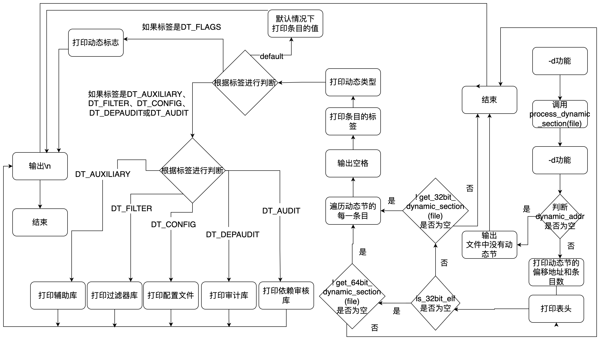

# 选项-d 的原理和具体实现

## 1.选项-d 的介绍

### 1.1.动态节区的数据结构

动态节区表是由Elf32_Dyn表项组成的数组。

```c
typedef struct
{
  Elf32_Sword	d_tag;			/* Dynamic entry type */
  union
    {
      Elf32_Word d_val;			/* Integer value */
      Elf32_Addr d_ptr;			/* Address value */
    } d_un;
} Elf32_Dyn;
```

动态节区表保存了动态链接器所需要的基本信息，比如依赖于哪些共享对象、动态链接符号表的位置、动态链接重定位表的位置、共享对象初始化代码的地址等.

1. d_tag：表明了动态表项的类型。以下是一些常见的类型:
   - DT_SYMTAB：表示动态链接符号表的地址，d_ptr为.dynsym的地址
   - DT_STRTAB：表示动态链接字符串表地址，d_ptr为.dynstr的地址
   - DT_STRSZ：动态链接字符串表大小，d_val为大小
   - DT_NEED：依赖的共享对象文件，d_ptr表示依赖的共享对象文件名
   - DT_REL：动态链接重定位表位置
2. d_val or d_ptr：是一个联合体，要么表示一个值，要么表示一个地址，具体的情况因动态表的类型不同而不同

### 1.2.静态链接

### 1.3.动态链接

## 2.选项-d 的作用

```shell
readelf -d
        --dynamic
```

附加参数-d用于显示动态节区.dynamic的信息。

## 3.选项-d 显示的信息解释

我们根据写的测试样例，使用指令 `./readelf main -d`得到了如下的结果：

```shell
dp@ubuntu:~/Desktop/elf/share$ readelf -d main

Dynamic section at offset 0x2ed8 contains 28 entries:
  Tag        Type                         Name/Value
 0x00000001 (NEEDED)                     Shared library: [lib.so]
 0x00000001 (NEEDED)                     Shared library: [libc.so.6]
 0x0000000c (INIT)                       0x1000
 0x0000000d (FINI)                       0x127c
 0x00000019 (INIT_ARRAY)                 0x3ed0
 0x0000001b (INIT_ARRAYSZ)               4 (bytes)
 0x0000001a (FINI_ARRAY)                 0x3ed4
 0x0000001c (FINI_ARRAYSZ)               4 (bytes)
 0x6ffffef5 (GNU_HASH)                   0x228
 0x00000005 (STRTAB)                     0x2c8
 0x00000006 (SYMTAB)                     0x248
 0x0000000a (STRSZ)                      162 (bytes)
 0x0000000b (SYMENT)                     16 (bytes)
 0x00000015 (DEBUG)                      0x0
 0x00000003 (PLTGOT)                     0x3fd8
 0x00000002 (PLTRELSZ)                   16 (bytes)
 0x00000014 (PLTREL)                     REL
 0x00000017 (JMPREL)                     0x3ec
 0x00000011 (REL)                        0x3ac
 0x00000012 (RELSZ)                      64 (bytes)
 0x00000013 (RELENT)                     8 (bytes)
 0x0000001e (FLAGS)                      BIND_NOW
 0x6ffffffb (FLAGS_1)                    Flags: NOW PIE
 0x6ffffffe (VERNEED)                    0x37c
 0x6fffffff (VERNEEDNUM)                 1
 0x6ffffff0 (VERSYM)                     0x36a
 0x6ffffffa (RELCOUNT)                   4
 0x00000000 (NULL)                       0x0
```

1. Type：表项的类型。
   我们以第一个为例 ` 0x00000001 (NEEDED) Shared library: [lib.so]`，可以得到，这一项表明了对共享库lib.so的依赖，这一点，我们可以通过ldd指令来查看一个可执行程序的共享库依赖，如下：

   ```shell
   dp@ubuntu:~/Desktop/elf/share$ ldd main
   linux-gate.so.1 (0xf7f18000)
   lib.so (0xf7f08000)
   libc.so.6 => /lib32/libc.so.6 (0xf7d01000)
   /lib/ld-linux.so.2 (0xf7f1a000)
   ```

   可以发现，这个可执行程序main依赖于我们自定义的lib.so，lib.so又依赖于stdio(libc.so)。这是由于我们的可执行程序引用了lib.c中的函数func，而函数func又引用了stdio中的printf函数。

   我们再以 `0x00000006 (SYMTAB)  0x248`为例，当我们使用指令 `readelf -S main`输出节区信息，结果如下：

   ```shell
   dp@ubuntu:~/Desktop/elf/share$ readelf -S  main
   There are 31 section headers, starting at offset 0x3800:

   Section Headers:
     [Nr] Name              Type            Addr     Off    Size   ES Flg Lk Inf Al
     [ 0]                   NULL            00000000 000000 000000 00      0   0  0
     [ 1] .interp           PROGBITS        000001b4 0001b4 000013 00   A  0   0  1
     [ 2] .note.gnu.build-i NOTE            000001c8 0001c8 000024 00   A  0   0  4
     [ 3] .note.gnu.propert NOTE            000001ec 0001ec 00001c 00   A  0   0  4
     [ 4] .note.ABI-tag     NOTE            00000208 000208 000020 00   A  0   0  4
     [ 5] .gnu.hash         GNU_HASH        00000228 000228 000020 04   A  6   0  4
     [ 6] .dynsym           DYNSYM          00000248 000248 000080 10   A  7   1  4
     [ 7] .dynstr           STRTAB          000002c8 0002c8 0000a2 00   A  0   0  1
     [ 8] .gnu.version      VERSYM          0000036a 00036a 000010 02   A  6   0  2
     [ 9] .gnu.version_r    VERNEED         0000037c 00037c 000030 00   A  7   1  4
     [10] .rel.dyn          REL             000003ac 0003ac 000040 08   A  6   0  4
     [11] .rel.plt          REL             000003ec 0003ec 000010 08  AI  6  24  4
     [12] .init             PROGBITS        00001000 001000 000024 00  AX  0   0  4
     [13] .plt              PROGBITS        00001030 001030 000030 04  AX  0   0 16
     [14] .plt.got          PROGBITS        00001060 001060 000010 10  AX  0   0 16
     [15] .plt.sec          PROGBITS        00001070 001070 000020 10  AX  0   0 16
     [16] .text             PROGBITS        00001090 001090 0001e9 00  AX  0   0 16
     [17] .fini             PROGBITS        0000127c 00127c 000018 00  AX  0   0  4
     [18] .rodata           PROGBITS        00002000 002000 000008 00   A  0   0  4
     [19] .eh_frame_hdr     PROGBITS        00002008 002008 000054 00   A  0   0  4
     [20] .eh_frame         PROGBITS        0000205c 00205c 000128 00   A  0   0  4
     [21] .init_array       INIT_ARRAY      00003ed0 002ed0 000004 04  WA  0   0  4
     [22] .fini_array       FINI_ARRAY      00003ed4 002ed4 000004 04  WA  0   0  4
     [23] .dynamic          DYNAMIC         00003ed8 002ed8 000100 08  WA  7   0  4
     [24] .got              PROGBITS        00003fd8 002fd8 000028 04  WA  0   0  4
     [25] .data             PROGBITS        00004000 003000 000008 00  WA  0   0  4
     [26] .bss              NOBITS          00004008 003008 000004 00  WA  0   0  1
     [27] .comment          PROGBITS        00000000 003008 00002b 01  MS  0   0  1
     [28] .symtab           SYMTAB          00000000 003034 000460 10     29  46  4
     [29] .strtab           STRTAB          00000000 003494 000252 00      0   0  1
     [30] .shstrtab         STRTAB          00000000 0036e6 000118 00      0   0  1
   Key to Flags:
     W (write), A (alloc), X (execute), M (merge), S (strings), I (info),
     L (link order), O (extra OS processing required), G (group), T (TLS),
     C (compressed), x (unknown), o (OS specific), E (exclude),
     p (processor specific)

   ```

   可以发现，节区.dynsym的地址0x248与节区头表中的信息一致，进一步验证了正确性。
2. Name/Value：名称或值。与具体的类型相关，当类型为NEEDED时，他的名称就是依赖的动态链接库，当类型的对应的符号表时，值就是动态链接符号表的地址。

## 4.代码实现

### 4.1算法思路

1. 定义一个名为 `ELF_process`的类的成员函数 `process_dynamic_section`，参数为一个文件指针 `file`。
2. 声明一个指向 `Elf32_Dyn`结构的指针 `entry`。
3. 如果 `dynamic_addr`非空（即存在动态节）：
   - 打印动态节的偏移地址和条目数。
   - 打印动态节的表头。
4. 否则，说明文件中没有动态节，打印相应的提示信息并返回0。
5. 如果是32位ELF文件：
   - 调用 `get_32bit_dynamic_section`函数从文件中获取32位动态节。
   - 如果获取失败，返回0。
6. 如果是64位ELF文件：
   - 调用 `get_64bit_dynamic_section`函数从文件中获取64位动态节。
   - 如果获取失败，返回0。
7. 进入循环，遍历动态节的每个条目，指针 `entry`从 `dynamic_section`开始，直到 `entry`指向的条目超过动态节的最后一个条目。
   - 声明一个指向字符常量的指针 `dtype`、输出一个空格。
   - 打印当前条目的标签。
   - 通过调用 `get_dynamic_type`函数获取条目的动态类型，并将结果赋给 `dtype`。
   - 打印动态类型，并根据类型的长度进行对齐。
   - 根据当前条目的标签进行判断：
     - 如果标签是 `DT_FLAGS`，调用 `print_dynamic_flags`函数打印动态标志。
     - 如果标签是 `DT_AUXILIARY`、`DT_FILTER`、`DT_CONFIG`、`DT_DEPAUDIT`或 `DT_AUDIT`，根据不同的标签打印对应的信息。
     - 否则，打印当前条目的值。
   - 换行。
8. 函数执行完毕。

### 4.2 流程图



### 4.3 代码详细解释

#### 4.3.1 主程序判断如下：

```c++
if(option & (1<<10))                    //-d
    {
        process_dynamic_section(file);
    }
```

#### 4.3.2 `process_dynamic_section(file)`

> 函数功能如下：
>
> 1. 定义一个名为 `ELF_process`的类的成员函数 `process_dynamic_section`，参数为一个文件指针 `file`。
> 2. 声明一个指向 `Elf32_Dyn`结构的指针 `entry`。
> 3. 如果 `dynamic_addr`非空（即存在动态节）：
>    - 打印动态节的偏移地址和条目数。
>    - 打印动态节的表头。
> 4. 否则，说明文件中没有动态节，打印相应的提示信息并返回0。
> 5. 如果是32位ELF文件：
>    - 调用 `get_32bit_dynamic_section`函数从文件中获取32位动态节。
>    - 如果获取失败，返回0。
> 6. 如果是64位ELF文件：
>    - 调用 `get_64bit_dynamic_section`函数从文件中获取64位动态节。
>    - 如果获取失败，返回0。
> 7. 进入循环，遍历动态节的每个条目，指针 `entry`从 `dynamic_section`开始，直到 `entry`指向的条目超过动态节的最后一个条目。
> 8. 在循环内部：
>    - 声明一个指向字符常量的指针 `dtype`。
>    - 输出一个空格。
>    - 打印当前条目的标签。
>    - 通过调用 `get_dynamic_type`函数获取条目的动态类型，并将结果赋给 `dtype`。
>    - 打印动态类型，并根据类型的长度进行对齐。
>    - 根据当前条目的标签进行判断：
>      - 如果标签是 `DT_FLAGS`，调用 `print_dynamic_flags`函数打印动态标志。
>      - 如果标签是 `DT_AUXILIARY`、`DT_FILTER`、`DT_CONFIG`、`DT_DEPAUDIT`或 `DT_AUDIT`，根据不同的标签打印对应的信息。
>      - 否则，打印当前条目的值。
>    - 换行。

```c++
int ELF_process::process_dynamic_section(FILE *file)
{
    // 定义指向Elf32_Dyn结构的指针entry
    Elf32_Dyn * entry;

	if(dynamic_addr) // 如果dynamic_addr非空
    {
        // 打印动态节的偏移地址和条目数
        printf ("\nDynamic section at offset 0x%x contains %u entries:\n",
                dynamic_addr, dynamic_nent);
        // 打印表头
        printf ("  Tag        Type                         Name/Value\n");
    }else{
        // 文件中没有动态节
    	printf ("\nThere are no dynamic section in this file.\n");
    	return 0;
    }
    // 如果是32位ELF文件
    if (is_32bit_elf)
    {
        // 调用get_32bit_dynamic_section函数获取32位动态节
        if (! get_32bit_dynamic_section (file))
            return 0;
    }
        // 如果是64位ELF文件，调用get_64bit_dynamic_section函数获取64位动态节
    else if (! get_64bit_dynamic_section (file))
        return 0;

    // 遍历动态节的每一条目
    for (entry = dynamic_section;
            entry < dynamic_section + dynamic_nent;
            entry++)
    {
        const char * dtype; // 定义记录条目的动态类型的指针
        // 输出空格
        putchar (' ');
        printf("0x%2.8x ",entry->d_tag);    // 打印条目的标签
        dtype = get_dynamic_type(entry->d_tag); // 获取条目的动态类型
        // 打印动态类型
        printf("(%s)%*s",dtype,(int)(27-strlen(dtype))," ");

        // 根据条目的标签进行判断
        switch (entry->d_tag)
        {
        case DT_FLAGS:  // 如果标签是DT_FLAGS
            // 调用print_dynamic_flags函数打印动态标志
            print_dynamic_flags (entry->d_un.d_val);
            break;

        case DT_AUXILIARY:
        case DT_FILTER:
        case DT_CONFIG:
        case DT_DEPAUDIT:
        case DT_AUDIT:  // 如果标签是DT_AUXILIARY、DT_FILTER、DT_CONFIG、DT_DEPAUDIT或DT_AUDIT
            switch (entry->d_tag)   // 根据标签进行判断
            {
            case DT_AUXILIARY:
                printf ("Auxiliary library");    // 辅助库
                break;

            case DT_FILTER:
                printf ("Filter library");  // 过滤器库
                break;

            case DT_CONFIG:
                printf ("Configuration file");  // 配置文件
                break;

            case DT_DEPAUDIT:
                printf ("Dependency audit library");    // 依赖审核库
                break;

            case DT_AUDIT:
                printf ("Audit library");   // 审计库
                break;
            }
            break;

        default:
            printf("0x%x",entry->d_un.d_val); // 默认情况下打印条目的值
        }

        printf("\n");
    }
}

```

##### 4.3.2.1 `get_32bit_dynamic_section`

> 函数功能如下下：
>
> 1. 定义一个名为 `ELF_process`的类的成员函数 `get_32bit_dynamic_section`，参数为一个文件指针 `file`。
> 2. 分配内存，用于存储32位动态节的外部表示，将其转换为 `Elf32_External_Dyn`类型的指针 `edyn`。
> 3. 定义一个指向32位动态节外部表示的指针 `ext`、一个指向32位动态节的指针 `entry`。
> 4. 将文件指针定位到动态节的偏移地址处。
> 5. 从文件中读取32位动态节数据到 `edyn`内存块中。
> 6. 如果 `edyn`为空，说明内存分配失败，return 0。
> 7. 遍历32位动态节的每个外部表示：
>    - 动态节条目数加1。
>    - 如果外部表示的标签为 `DT_NULL`，表示动态节结束，跳出循环。
> 8. 分配内存，用于存储32位动态节的内部表示，大小为动态节条目数乘以 `Elf32_Dyn`结构的大小。
> 9. 如果动态节内部表示的内存分配失败：
>    - 打印内存不足的提示信息。
>    - 释放 `edyn`的内存。
>    - 返回0。
> 10. 遍历动态节的每个条目，进行内外部表示的转换：
>     - 将外部表示的标签转换为内部表示。
>     - 将外部表示的值转换为内部表示。
> 11. 释放 `edyn`的内存。
> 12. 返回1，表示成功获取32位动态节。

```c++
int ELF_process::get_32bit_dynamic_section(FILE *file)
{
    // 分配内存，用于存储32位动态节的外部表示
    Elf32_External_Dyn * edyn = (Elf32_External_Dyn *) malloc(dynamic_size);
    // 定义指向32位动态节外部表示的指针
    Elf32_External_Dyn * ext;
    // 定义指向32位动态节的指针
    Elf32_Dyn * entry;

    // 将文件指针定位到动态节的偏移地址处
    fseek(file,dynamic_addr,SEEK_SET);
    // 从文件中读取32位动态节数据到edyn内存块中
    fread(edyn,dynamic_size,1,file);

    //如果edyn为空，说明分配内存失败
    if(edyn==NULL)
        return 0;

    // 遍历32位动态节的每个外部表示
    for (ext = edyn, dynamic_nent = 0;
            (char *) ext < (char *) edyn + dynamic_size;
            ext++)
    {
        // 动态节条目数加1
        dynamic_nent++;
        // 如果外部表示的标签为DT_NULL，表示结束
        if (BYTE_GET (ext->d_tag) == DT_NULL)
            break;
    }
    // 分配内存，用于存储32位动态节的内部表示
    dynamic_section = (Elf32_Dyn *) cmalloc (dynamic_nent,
                      sizeof (* entry));

    // 如果动态节内部表示的内存分配失败
    if (dynamic_section == NULL)
    {
        printf("Out of memory\n");  // 打印内存不足
        free (edyn);    // 释放edyn的内存
        return 0;
    }

    // 遍历动态节的每个条目，进行内外部表示的转换
    for (ext = edyn, entry = dynamic_section;
            entry < dynamic_section + dynamic_nent;
            ext++, entry++)
    {
        entry->d_tag      = BYTE_GET (ext->d_tag);  // 将外部表示的标签转换为内部表示
        entry->d_un.d_val = BYTE_GET (ext->d_un.d_val); // 将外部表示的值转换为内部表示
    }

    free(edyn); // 释放edyn的内存

    return 1;
}
```

##### 4.3.2.2 `BYTE_GET(field)`：小端转大端

即 `byte_get_little_endian (unsigned char *field, int size)`

> 小端转大端：该函数根据输入的字长度，对字段中的字节进行转换，将其从小端方式转换为大端方式，并返回转换后的值。
>
> 1. 定义函数 `byte_get_little_endian`，该函数用于按照小端方式对字进行转换读取，并将其转换为大端方式。
> 2. 接收参数 `field`，这是一个指向无符号字符的指针，表示要进行转换的字字段。
> 3. 接收参数 `size`，表示要转换的字的长度。
> 4. 使用 `switch` 语句根据字的长度执行相应的转换操作。
> 5. 如果字的长度为 1，直接返回字段的值。
> 6. 如果字的长度为 2，将字段中的两个字节进行转换为大端方式，并返回转换后的值。
> 7. 如果字的长度为 3，将字段中的三个字节进行转换为大端方式，并返回转换后的值。
> 8. 如果字的长度为 4，将字段中的四个字节进行转换为大端方式，并返回转换后的值。

```c++
//按照小端方式对字进行转换读取，转换为大端方式
int byte_get_little_endian (unsigned char *field, int size)
{
    //依据字的长度进行转换
    switch (size)
    {
    case 1:
        // 如果字长度为1，则直接返回字段的值
        return *field;
    case 2: 
        // 如果字长度为2，则将字段中的两个字节进行转换为大端方式，并返回转换后的值
        return ((unsigned int)(field[0]))
               | (((unsigned int)(field[1])) << 8);
    case 3:
        // 如果字长度为3，则将字段中的三个字节进行转换为大端方式，并返回转换后的值
        return  ((unsigned long) (field[0]))
                |    (((unsigned long) (field[1])) << 8)
                |    (((unsigned long) (field[2])) << 16);

    case 4:
        // 如果字长度为4，则将字段中的四个字节进行转换为大端方式，并返回转换后的值
        return  ((unsigned long) (field[0]))
                |    (((unsigned long) (field[1])) << 8)
                |    (((unsigned long) (field[2])) << 16)
                |    (((unsigned long) (field[3])) << 24);
    }

}
```

##### 4.3.2.3 `get_dynamic_type(unsigned long type)`

> 该函数根据给定的动态类型值（`type`），返回相应的类型字符串。每个 `case`语句对应不同的动态类型，当输入的 `type`与某个动态类型匹配时，返回对应的字符串表示。如果输入的 `type`没有匹配的情况，最后返回 `NULL`。注释中的字符串表示对应的动态类型名称。
>
> | 1. 基本类型（Base Types）：  | -`DT_NULL`   - `DT_NEEDED`   - `DT_PLTRELSZ`   - `DT_PLTGOT`   - `DT_HASH`   - `DT_STRTAB`   - `DT_SYMTAB`   - `DT_RELA`   - `DT_RELASZ`   - `DT_RELAENT`   - `DT_STRSZ`   - `DT_SYMENT`   - `DT_INIT`   - `DT_FINI`   - `DT_SONAME`   - `DT_RPATH`   - `DT_SYMBOLIC`   - `DT_REL`   - `DT_RELSZ`   - `DT_RELENT`   - `DT_PLTREL`   - `DT_DEBUG`   - `DT_TEXTREL`   - `DT_JMPREL`   - `DT_BIND_NOW`   - `DT_INIT_ARRAY`   - `DT_FINI_ARRAY`   - `DT_INIT_ARRAYSZ`   - `DT_FINI_ARRAYSZ`   - `DT_RUNPATH`   - `DT_FLAGS`                                                                                                                                                                            |
> | ---------------------------- | ---------------------------------------------------------------------------------------------------------------------------------------------------------------------------------------------------------------------------------------------------------------------------------------------------------------------------------------------------------------------------------------------------------------------------------------------------------------------------------------------------------------------------------------------------------------------------------------------------------------------------------------------------------------------------------------------------------------------------------------------------------------- |
> | 扩展类型（Extended Types）： | -`DT_PREINIT_ARRAY` - `DT_PREINIT_ARRAYSZ`   - `DT_CHECKSUM`   - `DT_PLTPADSZ`   - `DT_MOVEENT`   - `DT_MOVESZ`   - `DT_FEATURE`   - `DT_POSFLAG_1`   - `DT_SYMINSZ`   - `DT_SYMINENT`   - `DT_ADDRRNGLO`   - `DT_CONFIG`   - `DT_DEPAUDIT`   - `DT_AUDIT`   - `DT_PLTPAD`   - `DT_MOVETAB`   - `DT_SYMINFO`   - `DT_VERSYM`   - `DT_TLSDESC_GOT`   - `DT_TLSDESC_PLT`   - `DT_RELACOUNT`   - `DT_RELCOUNT`   - `DT_FLAGS_1`   - `DT_VERDEF`   - `DT_VERDEFNUM`   - `DT_VERNEED`   - `DT_VERNEEDNUM`   - `DT_AUXILIARY`   - `DT_USED`   - `DT_FILTER`   - `DT_GNU_PRELINKED`   - `DT_GNU_CONFLICT`   - `DT_GNU_CONFLICTSZ`   - `DT_GNU_LIBLIST`   - `DT_GNU_LIBLISTSZ`   - `DT_GNU_HASH` |

```c++
const char *ELF_process::get_dynamic_type(unsigned long type)
{

    static char buff[64];// 静态字符数组，用于存储返回的类型字符串

    switch (type)	//判断传入的标志type并输出
    {

    case DT_NULL:
        return "NULL";
    case DT_NEEDED:
        return "NEEDED";
    case DT_PLTRELSZ:
        return "PLTRELSZ";
    case DT_PLTGOT:
        return "PLTGOT";
    case DT_HASH:
        return "HASH";
    case DT_STRTAB:
        return "STRTAB";
    case DT_SYMTAB:
        return "SYMTAB";
    case DT_RELA:
        return "RELA";
    case DT_RELASZ:
        return "RELASZ";
    case DT_RELAENT:
        return "RELAENT";
    case DT_STRSZ:
        return "STRSZ";
    case DT_SYMENT:
        return "SYMENT";
    case DT_INIT:
        return "INIT";
    case DT_FINI:
        return "FINI";
    case DT_SONAME:
        return "SONAME";
    case DT_RPATH:
        return "RPATH";
    case DT_SYMBOLIC:
        return "SYMBOLIC";
    case DT_REL:
        return "REL";
    case DT_RELSZ:
        return "RELSZ";
    case DT_RELENT:
        return "RELENT";
    case DT_PLTREL:
        return "PLTREL";
    case DT_DEBUG:
        return "DEBUG";
    case DT_TEXTREL:
        return "TEXTREL";
    case DT_JMPREL:
        return "JMPREL";
    case DT_BIND_NOW:
        return "BIND_NOW";
    case DT_INIT_ARRAY:
        return "INIT_ARRAY";
    case DT_FINI_ARRAY:
        return "FINI_ARRAY";
    case DT_INIT_ARRAYSZ:
        return "INIT_ARRAYSZ";
    case DT_FINI_ARRAYSZ:
        return "FINI_ARRAYSZ";
    case DT_RUNPATH:
        return "RUNPATH";
    case DT_FLAGS:
        return "FLAGS";

    case DT_PREINIT_ARRAY:
        return "PREINIT_ARRAY";
    case DT_PREINIT_ARRAYSZ:
        return "PREINIT_ARRAYSZ";

    case DT_CHECKSUM:
        return "CHECKSUM";
    case DT_PLTPADSZ:
        return "PLTPADSZ";
    case DT_MOVEENT:
        return "MOVEENT";
    case DT_MOVESZ:
        return "MOVESZ";
    case DT_FEATURE:
        return "FEATURE";
    case DT_POSFLAG_1:
        return "POSFLAG_1";
    case DT_SYMINSZ:
        return "SYMINSZ";
    case DT_SYMINENT:
        return "SYMINENT"; /* aka VALRNGHI */

    case DT_ADDRRNGLO:
        return "ADDRRNGLO";
    case DT_CONFIG:
        return "CONFIG";
    case DT_DEPAUDIT:
        return "DEPAUDIT";
    case DT_AUDIT:
        return "AUDIT";
    case DT_PLTPAD:
        return "PLTPAD";
    case DT_MOVETAB:
        return "MOVETAB";
    case DT_SYMINFO:
        return "SYMINFO"; /* aka ADDRRNGHI */

    case DT_VERSYM:
        return "VERSYM";

    case DT_TLSDESC_GOT:
        return "TLSDESC_GOT";
    case DT_TLSDESC_PLT:
        return "TLSDESC_PLT";
    case DT_RELACOUNT:
        return "RELACOUNT";
    case DT_RELCOUNT:
        return "RELCOUNT";
    case DT_FLAGS_1:
        return "FLAGS_1";
    case DT_VERDEF:
        return "VERDEF";
    case DT_VERDEFNUM:
        return "VERDEFNUM";
    case DT_VERNEED:
        return "VERNEED";
    case DT_VERNEEDNUM:
        return "VERNEEDNUM";

    case DT_AUXILIARY:
        return "AUXILIARY";
    case DT_USED:
        return "USED";
    case DT_FILTER:
        return "FILTER";

    case DT_GNU_PRELINKED:
        return "GNU_PRELINKED";
    case DT_GNU_CONFLICT:
        return "GNU_CONFLICT";
    case DT_GNU_CONFLICTSZ:
        return "GNU_CONFLICTSZ";
    case DT_GNU_LIBLIST:
        return "GNU_LIBLIST";
    case DT_GNU_LIBLISTSZ:
        return "GNU_LIBLISTSZ";
    case DT_GNU_HASH:
        return "GNU_HASH";


    }

    return NULL;
}
```

##### 4.3.2.4 `print_dynamic_flags(Elf32_Word flags)`

> 该函数用于打印 ELF 文件中的动态标志（dynamic flags），用于提供关于 ELF 文件的特性和属性的信息。它接收一个 `Elf32_Word` 类型的标志参数 `flags`。
>
> 函数使用一个 `while` 循环来处理标志，直到所有的标志都被处理完。在每次循环迭代中，它从 `flags` 中提取出最低位的标志，然后通过按位与操作清除该标志位。
>
> 在处理每个标志时，函数根据标志的值进行 `switch` 判断，输出相应的字符串表示该标志的含义。其中包括了一些已知的标志，如 `ORIGIN`、`SYMBOLIC`、`TEXTREL`、`BIND_NOW`、`STATIC_TLS`，对应的字符串会输出到标准输出中。
>
> 如果遇到未知的标志，将输出字符串"unknown"表示未知标志。

```c++
void ELF_process::print_dynamic_flags(Elf32_Word flags)
{

    int first = 1;

    while (flags)
    {
        Elf32_Word flag;    // 当前处理的标志

        flag = flags & - flags; // 提取最低位的标志
        flags &= ~ flag;    // 清除已处理的标志位

        if (first)
            first = 0;
        else
            putc (' ', stdout);     // 在标志之间输出空格

        switch (flag)
        {
        case DF_ORIGIN:
            fputs ("ORIGIN", stdout);   // 输出"ORIGIN"
            break;
        case DF_SYMBOLIC:
            fputs ("SYMBOLIC", stdout);   // 输出"SYMBOLIC"
            break;
        case DF_TEXTREL:
            fputs ("TEXTREL", stdout);   // 输出"TEXTREL"
            break;
        case DF_BIND_NOW:
            fputs ("BIND_NOW", stdout);    // 输出"BIND_NOW"
            break;
        case DF_STATIC_TLS:
            fputs ("STATIC_TLS", stdout);   // 输出"STATIC_TLS"
            break;
        default:
            fputs (("unknown"), stdout);    // 输出"unknown"表示未知标志
            break;
        }
    }

}
```

### 4.4.测试

我们先编写测试代码。要实现动态链接的方式，我们需要定义库函数，实现打印输出的功能，同时，这个库也使用外部库stdio的printf符号。lib.c代码如下：

```c
#include<stdio.h>
int cnt = 0;
int func(){
        cnt++;
        printf("%d\n",cnt);
}
```

接下来对这段代码进行编译，使用-fPIC指令让其编译为位置无关的代码，作为动态链接库lib.so使用。

```shell
dp@ubuntu:~/Desktop/elf/share$ gcc -shared -fpic -o lib.so lib.c
```

然后我们编写主测试程序，这个程序引用这个动态链接库的cnt变量和func函数。main.c代码如下：

```c
extern void func();
extern int cnt;

int main(){
        func();
}
```

然后进行编译为可执行文件，下面编译中使用库文件，不是为了将库中代码段和数据段合并入可执行文件，而仅仅只是传递符号表和重定位信息告诉可执行文件这里可以进行动态重定位。

```shell
dp@ubuntu:~/Desktop/elf/share$ gcc -m32 -o main main.c lib.so
```

然后执行，执行的时候需要修改环境变量，将当前目录下的动态链接文件添加到环境变量中去。

```shell
dp@ubuntu:~/Desktop/elf/share$ export LD_LIBRARY_PATH=$LD_LIBRARY_PATH:./ 
dp@ubuntu:~/Desktop/elf/share$ ./main
1
```

自此完成了测试程序的编写，上面的解释将基于这个测试程序。
